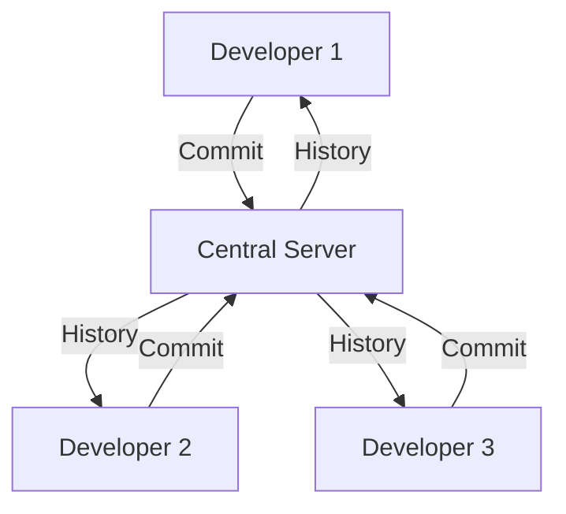
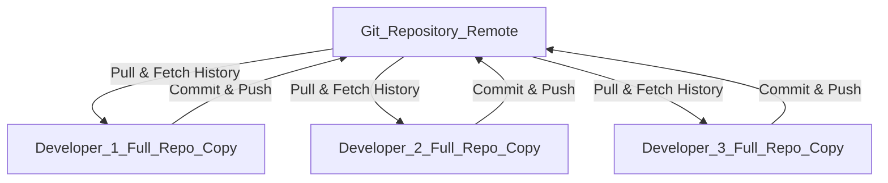

## What is Git?

**Git** is a **distributed version control system (VCS).**

- **Version control** means it keeps track of changes made to files (usually source code).  
- **Distributed** means every developer has a complete copy of the project history on their own machine (not just a snapshot).  

👉 Think of Git as a **time machine for your code**: you can go back to any point in history, see who made what changes, and why.  

---

## Why use Git?

### 1. Track changes over time
You can see what changed, when, and by whom.  

### 2. Experiment safely
With branches, you can try new features without breaking the main project.  

### 3. Collaboration
Multiple developers can work on the same project without overwriting each other’s work.  

### 4. Error recovery
If you break something, you can roll back to a previous working version.  

### 5. Distributed nature
- You don’t need to be online to use Git; everything is local.  
- Even if the central server goes down, every developer has a full backup.  

### 6. Industry standard
Most companies and open-source projects use Git. Tools like **GitHub**, **GitLab**, and **Bitbucket** are built on top of Git.  

---

👉 **In short:** Git is not just about “saving code,” it’s about **collaboration, safety, and control**.  

---

## 🔹 Visualizing Git

## Centralized Version Control (Old Way)

⚠️ Problem: If the central server goes down, nobody can work or access full history.

## Distributed Version Control (Git Way)

✅ Advantage: Every developer has the entire history. Even if the central repo disappears, each copy is a full backup.
