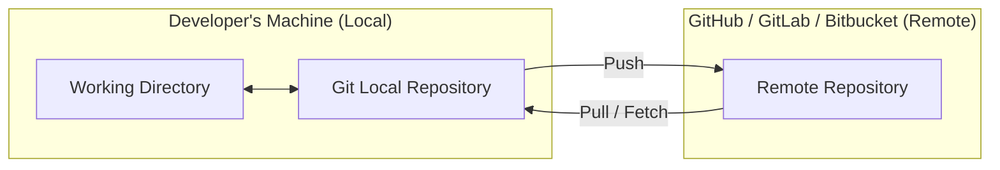

# Difference Between Git and GitHub/GitLab/Bitbucket

## 1. What is Git?

- **Git** is a **distributed version control system (DVCS)**.  
- It is installed on your computer and lets you:  
  - Track changes to files.  
  - Branch and merge code.  
  - Manage the complete history of your project locally.  
- Works **offline** — you don’t need internet to use Git.  

👉 Think of Git as the **engine** that powers version control.  

---

## 2. What are GitHub, GitLab, Bitbucket?

- These are **cloud hosting platforms** built on top of Git.  
- They provide a place to **store repositories online** and make collaboration easy.  
- Features beyond Git itself:  
  - Remote hosting of repositories.  
  - Pull requests / merge requests.  
  - Issue tracking and project boards.  
  - CI/CD pipelines for automation.  
  - Permissions and team management.  

👉 Think of them as **services that use Git under the hood**, adding collaboration and project management features.  

---

## 3. How they work together

1. You use **Git locally** to make commits.  
2. You **push** your commits to a remote repository hosted on GitHub/GitLab/Bitbucket.  
3. Other developers **pull** the changes from the remote repository to their local machines.  
4. Everyone can work in parallel, while the remote repository acts as the **sync point**.  

---

## 4. Workflow Diagram

## 5. Key Differences

| Feature         | Git                      | GitHub/GitLab/Bitbucket           |
| --------------- | ----------------------   | --------------------------------- |
| What it is      | A version control tool   | Hosting & collaboration platforms |
| Where it runs   | On your local machine    | In the cloud (web-based)          |
| Works offline?  | ✅ Yes                  | ❌ No (needs internet)            |
| Stores history? | ✅ Full history locally | ✅ Full history on remote         |
| Extra features  | Version control only     | Issues, PR/MR, CI/CD, teams       |

## 6. Summary

Git = Tool (installed locally, manages history, works offline).

GitHub/GitLab/Bitbucket = Services (store Git repos online, enable collaboration).

Together, they let you:

Work locally and independently with Git.

Sync and collaborate with others via remote hosting platforms.

👉 You can think of Git as the car engine and GitHub/GitLab/Bitbucket as the highway system that lets multiple cars travel together.
