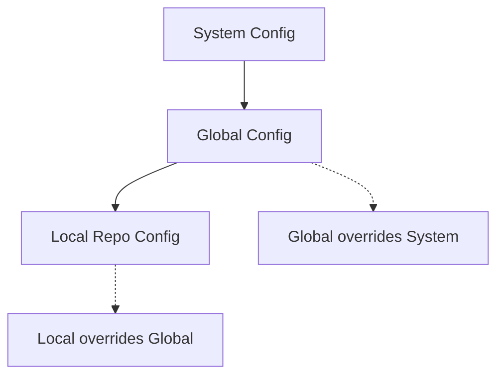
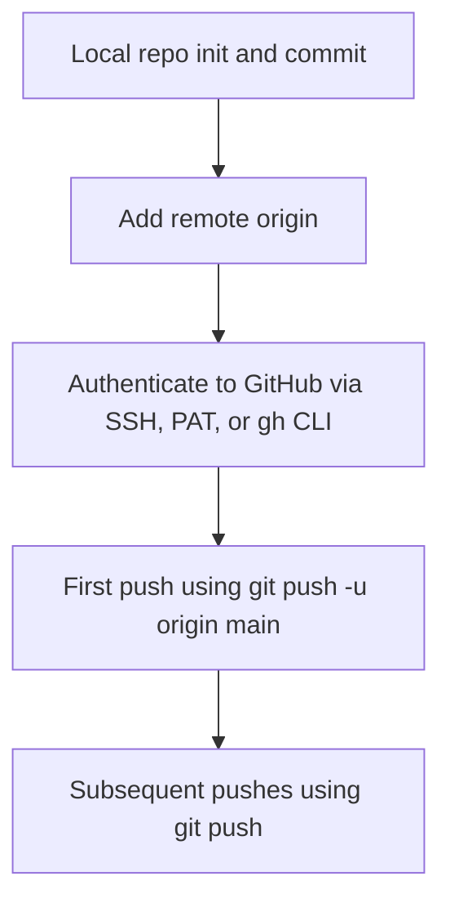

# Git Configuration — step-by-step, in detail  

## Quick overview 
Git has **three configuration levels** (system, global, local). Settings at a lower level **override** higher levels. You use `git config` to view/change them.

---

## 1. The three config levels

- **System** — settings for *all users* on the machine (file: `/etc/gitconfig`).  
- **Global** (a.k.a. user) — settings for your user account (file: `~/.gitconfig` or `~/.config/git/config`).  
- **Local** (repo) — settings for the current repository only (file: `./.git/config`).  
  - **Precedence**: local > global > system (local overrides global overrides system).



> File paths (typical):  
> - System: `/etc/gitconfig`  
> - Global: `~/.gitconfig` or `~/.config/git/config` (XDG)  
> - Local: `<repo>/.git/config`

---

## 2. List / inspect config values 

- List all effective settings (merged from all levels):

```bash
git config --list
```

- Show origin file for each setting (very useful to see where a key comes from):

```bash
git config --show-origin --list
```

- List only global settings:

```bash
git config --global --list
# or
git config --list --global
```

- List system settings (may require sudo):

```bash
sudo git config --system --list
```

- Show a specific key (reads according to precedence; run inside a repo to see repo-local value first):

```bash
git config user.name
```

---

## 3. Set / change config values 

- Set global user name and email (recommended first step):

```bash
git config --global user.name "John Doe"
git config --global user.email "john@example.com"
```

- Set a repository-local override (run inside the repo — `--local` is default):

```bash
git config user.name "John Local"
# or explicitly:
git config --local user.name "John Local"
```

- Set system-wide (affects all users; usually requires admin/sudo):

```bash
sudo git config --system core.autocrlf false
```

- Open the global config in your default editor:

```bash
git config --global --edit
```

- Edit the repo config:

```bash
git config --edit
# or open .git/config directly with your editor
```

---

## 4. Useful common settings / examples

- Set default editor (e.g., VS Code):

```bash
git config --global core.editor "code --wait"
```

- Create handy aliases:

```bash
git config --global alias.co checkout
git config --global alias.br branch
git config --global alias.st status
git config --global alias.lg "log --oneline --graph --all --decorate"
```

Use them: `git co`, `git br`, `git lg`

- Set default push behavior:

```bash
git config --global push.default simple
```

- Enable commit signing (if you use GPG/SSH keys):

```bash
git config --global user.signingkey "ABCDEF123456"
git config --global commit.gpgsign true
```

- Remove a config key:

```bash
git config --global --unset user.name
# or remove all values for a key:
git config --global --unset-all alias.co
```

---

## 5. Where the settings live (files) & how to inspect them

- Global config files:
  - `~/.gitconfig` (common)
  - `~/.config/git/config` (if using XDG)
- System config:
  - `/etc/gitconfig` (or platform equivalent)
- Repo-local config:
  - `<repo>/.git/config`

To quickly view the global file:

```bash
cat ~/.gitconfig
# or
git config --global --list --show-origin
```

---

## 6. `.git` folder internals — what lives inside a repo 


- **HEAD** — pointer to the current branch/tip (file contains e.g. `refs/heads/main`).  
- **config** — repo-local settings (what `git config` edits without `--global` changes).  
- **hooks/** — client-side hooks (pre-commit, pre-push, etc.) — scripts you can customize.  
- **refs/** — where branch and tag refs live (`refs/heads/*`, `refs/tags/*`).  
- **objects/** — the Git object database (blobs, trees, commits).  
- **logs/** — reflog information for refs (useful for recovery).  
- **info/** — additional metadata (e.g., exclude patterns).

To see these files:

```bash
ls -la .git
ls .git/refs
cat .git/HEAD
cat .git/config
```

---

## 7. Precedence rules

When Git resolves a setting it checks:  
1. **Local repo** (`.git/config`)  
2. **Global** (`~/.gitconfig` or XDG)  
3. **System** (`/etc/gitconfig`)  
4. **Built-in defaults**

So if `user.name` exists in both local and global, the **local value wins** for that repository.

Use `git config --show-origin --list` to verify where each value comes from.

---

## 8. Troubleshooting common config issues

- **You committed with the wrong email** (one-off fix for the last commit):

```bash
git commit --amend --author="Correct Name <correct@example.com>"
# then force-push if you already pushed:
git push --force-with-lease
```

- **Change author/email for many commits** — this rewrites history; prefer `git filter-repo` (or `git filter-branch` legacy). Be careful on shared branches.

- **Global settings not applied** — check `git config --show-origin --list` to see if a repo-local config is overriding global.

- **Need to edit system config** — use sudo: `sudo git config --system --edit`

---

## 9. Best practices & recommendations

1. **Always set global user.name and user.email** once on a machine.  
2. Use repo-local overrides only when you need a different identity for a specific project.  
3. Use `git config --global --edit` to inspect and learn the file format.  
4. Use aliases to speed up common workflows (`co`, `lg`, etc.).  
5. Use `--show-origin` when things look wrong — it tells you where a value was defined.  
6. If you must rewrite commit metadata, coordinate with collaborators and prefer `--force-with-lease` for pushes.

---

## 10. Quick hands-on exercises

1. Check current config:

```bash
git config --list
git config --show-origin --list
```

2. Set your global identity:

```bash
git config --global user.name "Your Name"
git config --global user.email "you@domain.com"
```

3. Create an alias and test it:

```bash
git config --global alias.co checkout
# Now try:
git co -b test-branch
```

4. Inspect repo-local config (inside a repo):

```bash
git init demo-repo && cd demo-repo
git config user.name "Repo Specific"
git config --list
cat .git/config
```

---

## Quick summary

- `git config` reads and writes Git settings at **system**, **global**, and **local** levels.  
- **Local overrides global overrides system.**  
- Use `--show-origin` to discover where values come from.  
- `.git/config` is the repo-local file; `~/.gitconfig` is the typical global file.  
- Aliases, editor, signing keys, and other options are all controlled via `git config`.

---

## **ADDITIONAL SECTION** — Push to GitHub: New account vs existing user (step-by-step)

> **Goal:** The following steps explain exactly what a user (new GitHub account or existing) must do to be able to push to GitHub from a local machine.

---

## Overview: why `git remote add origin` alone is not enough

Adding `git remote add origin <url>` only tells your local repo where the remote lives.  
To push, GitHub must **authenticate** you and authorize the operation. GitHub **does not accept passwords** for pushes — you need either **SSH keys** or a **Personal Access Token (PAT)** for HTTPS, or use **gh auth** (GitHub CLI). Some systems can cache credentials, but the authentication setup is generally a one-time per-machine step.

---

## Section A — Step-by-step: New GitHub user (fresh account, new machine)

**Assumptions:** you created a GitHub account and a remote repository (empty repo) on github.com.

### 1. Set identity on your machine (one time per machine)

```bash
git config --global user.name "Your Name"
git config --global user.email "you@example.com"
```

### 2. Initialize local repo and create initial commit (if not already)

```bash
cd /path/to/project
git init
git add .
git commit -m "Initial commit"
```

### 3. Add the remote URL

*HTTPS version:*

```bash
git remote add origin https://github.com/yourusername/your-repo.git
```

*SSH version (if you plan to use SSH):*

```bash
git remote add origin git@github.com:yourusername/your-repo.git
```

> Do **not** push yet if you haven't configured auth.

### 4A. Authenticate with HTTPS + Personal Access Token (PAT) — beginner friendly

1. On GitHub: **Settings → Developer settings → Personal access tokens** (classic) or **Fine-grained tokens**.  
2. Generate a token with `repo` scope (and other scopes if needed). Copy it (you'll see it only once).  
3. Push and enter credentials when prompted:

```bash
git push -u origin main
# Username: your GitHub username
# Password: <paste the PAT here>
```

4. (Optional) Cache the token so you don't re-enter it:

```bash
git config --global credential.helper store
# or on macOS:
git config --global credential.helper osxkeychain
# or on Windows:
git config --global credential.helper manager-core
```

> After credential helper is configured, you typically sign in once and future `git push` won't ask.

### 4B. Authenticate with SSH (recommended for devs)

1. Generate an SSH key (ed25519 recommended):

```bash
ssh-keygen -t ed25519 -C "you@example.com"
# accept defaults or set a passphrase
```

2. Start the ssh-agent and add your key:

```bash
eval "$(ssh-agent -s)"
ssh-add ~/.ssh/id_ed25519
```

3. Copy your public key and add it to GitHub:

```bash
cat ~/.ssh/id_ed25519.pub
# copy output and add to GitHub -> Settings -> SSH and GPG keys -> New SSH key
```

4. Test SSH connection:

```bash
ssh -T git@github.com
# expected: Hi yourusername! You've successfully authenticated...
```

5. Ensure your remote uses SSH (set if necessary):

```bash
git remote set-url origin git@github.com:yourusername/your-repo.git
```

6. Push:

```bash
git push -u origin main
```

**Result:** after this one-time SSH setup per machine, pushes work without entering username/password.

### 5. Alternative: GitHub CLI (`gh`) login

If you have GitHub CLI installed:

```bash
gh auth login
# follow interactive prompts to authenticate via web or SSH
```

`gh auth login` makes subsequent pushes seamless (it can configure credentials or SSH for you).

---

## Section B — Step-by-step: Existing GitHub user (already has account) on a new machine

**Scenario A: you already have SSH keys on an older machine**

- You must add a new key on the new machine to your GitHub account (repeat SSH setup steps above: generate key, add to GitHub, test).

**Scenario B: you used HTTPS+password previously (older behavior)**

- Password pushes are no longer supported. Create a PAT and use it as the password, or switch to SSH. Follow the PAT or SSH steps above.

**Checklist for existing users on a new machine:**

1. Set `user.name` and `user.email` globally on the new machine.
2. Choose auth method:
   - SSH: generate key, add to GitHub, test.
   - HTTPS: generate PAT, push once and store credentials with a credential helper.
   - Or use `gh auth login`.
3. Add remote (if local repo was initialized elsewhere) and push.

---

## Section C — Step-by-step: Same machine, new repository for existing user

If you've already configured SSH or credential helper on your machine, the flow is simple:

1. In local project:

```bash
git init
git add .
git commit -m "Initial commit"
git remote add origin git@github.com:yourusername/new-repo.git
git push -u origin main
```

2. If you used HTTPS and have stored credentials, `git push` will succeed without prompting.

---

## Section D — Common failure modes and fixes

| Symptom | Likely cause | Fix |
|---------|--------------|-----|
| `Permission denied (publickey)` | SSH key not added to GitHub or agent not running | Add your public key to GitHub, `ssh-add`, test `ssh -T git@github.com` |
| `fatal: Authentication failed` | Using password or no valid PAT/cached credential | Create PAT or configure credential helper, use PAT as password |
| `remote: Repository not found` | Wrong remote URL or permissions | Check `git remote -v`, correct URL, ensure account has access |
| `error: src refspec main does not match any` | No local branch named `main` or no commits | Create and commit: `git commit -m "init"` then push |
| `remote: Permission to user/repo denied to otheruser` | Pushing with wrong GitHub account | Ensure correct credentials (switch credential helper or SSH key), `gh auth login` |

---

## Section E — Notes about “do I need to do this every time?”

- **user.name / user.email** → one-time per machine (or per user account).
- **Adding remote** → one-time per repository (unless you change it).
- **SSH key / PAT** → one-time per machine (PAT may expire).
- **Credential helper** → one-time configuration to avoid repeated prompts.
- **`git push` / `git add` / `git commit`** → repeated for each change.

---

## Section F — Visual flow (high level)



---

## Final checklist before first push (new account or new machine)

1. `git config --global user.name` and `user.email` set.  
2. Local repo initialized and at least one commit exists.  
3. Remote added (`git remote add origin <url>`).  
4. Authentication configured:
   - SSH key added to GitHub **OR**
   - PAT created and credential helper configured **OR**
   - `gh auth login` done.  
5. Run `git push -u origin main` (first time sets upstream).

---

## Appendices / quick commands reference

- Set identity:

```bash
git config --global user.name "Your Name"
git config --global user.email "you@example.com"
```

- Create SSH key (ed25519):

```bash
ssh-keygen -t ed25519 -C "you@example.com"
eval "$(ssh-agent -s)"
ssh-add ~/.ssh/id_ed25519
cat ~/.ssh/id_ed25519.pub  # copy to GitHub
```

- Add remote:

```bash
git remote add origin git@github.com:username/repo.git
# or HTTPS:
git remote add origin https://github.com/username/repo.git
```

- First push (set upstream):

```bash
git push -u origin main
```

- Change remote URL (HTTPS ⇄ SSH):

```bash
git remote set-url origin git@github.com:username/repo.git
```

---

## Closing notes
 
- Recommended default for developers: **SSH** (one-time key per machine). For beginners, **HTTPS + PAT** is acceptable and simpler to set up initially.  
- Keep `git config --show-origin --list` in your toolbox to debug which config file is supplying a value.

---

