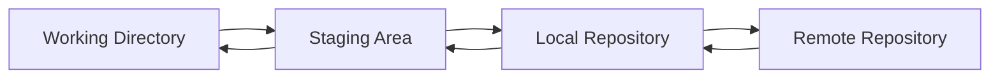

# Basic Git Workflow

The **basic Git workflow** involves four main commands:

1. `git init` → initialize a repository  
2. `git status` → check what’s going on  
3. `git add` → stage files  
4. `git commit` → save changes into history  

---

## 1. `git init`

- This turns a folder into a **Git repository**.  
- Creates a hidden `.git/` directory that stores all version history, configs, and references.  

**Example:**

```bash
mkdir my-project
cd my-project
git init
```

**Output:**

```
Initialized empty Git repository in /path/to/my-project/.git/
```

---

## 2. `git status`

- Shows the **state of your working directory** and **staging area**.  

**Example:**

```bash
git status
```

**Output might show:**

- New files not tracked by Git  
- Modified files not staged  
- Files staged for commit  

---

## 3. `git add`

- Moves files into the **staging area** (also called the index).  
- Think of staging as a “to-do list” for your next commit.  

**Example:**

```bash
git add file1.txt
```

or to add everything:

```bash
git add .
```

---

## 4. `git commit`

- Saves a **snapshot** of staged changes into the Git history.  
- Commits are permanent checkpoints you can return to.  

**Example:**

```bash
git commit -m "Add initial project files"
```

---

## Git Workflow Diagram



---

## How It Works

- **Working Directory → Staging Area** = `git add`  
- **Staging Area → Local Repository** = `git commit`  
- **Local Repository → Remote Repository** = `git push`  
- **Remote Repository → Local Repository** = `git fetch` / `git pull`  

---

## Explaining the Reverse Arrows

- **Local Repository → Staging Area** = `git reset`  
  - Moves committed changes back into the staging area if you want to recommit differently.  

- **Staging Area → Working Directory** = `git restore --staged`  
  - Unstages files (removes them from staging) but keeps them in the working directory.  

- **Local Repository → Working Directory** = `git checkout`, `git restore`, or `git reset --hard`  
  - Replaces working directory files with a version from history.  

---

## Key Ideas

1. **Working Directory** → where you edit your files.  
2. **Staging Area (Index)** → the “shopping cart” of changes waiting to be committed.  
3. **Local Repository (.git folder)** → permanent history stored on your machine.  
4. **Remote Repository (GitHub/GitLab/Bitbucket)** → shared copy that multiple developers collaborate on.  

👉 The forward arrows show the **normal workflow**, and the backward arrows show how you can **undo, reset, or retrieve** changes.
