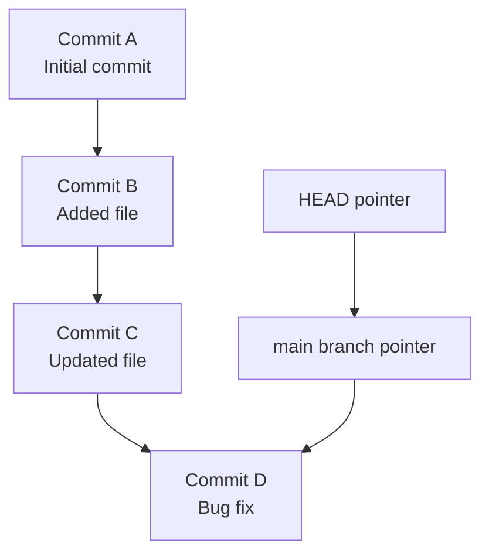

# Understanding the `.git` Folder and Git Versioning

When you run:

```bash
git init
```

Git creates a **hidden folder** called `.git` in your project directory.  
This folder is the **heart of Git** — it contains all the data Git needs to track your project’s history.  
Without it, your project is just a normal folder with files.

---

##  What’s Inside the `.git` Folder?

Here are the key components (simplified):

```
.git
├── config
├── HEAD
├── index
├── objects/
├── refs/
└── logs/
```

## 1. `config`
- Stores repository-specific settings (like remote URLs, username, branches).  
- Example:
  ```ini
  [core]
      repositoryformatversion = 0
      filemode = true
      bare = false
  [remote "origin"]
      url = git@github.com:user/repo.git
      fetch = +refs/heads/*:refs/remotes/origin/*
  ```

## 2. `HEAD`
- A file that points to the **current branch reference**.  
- Example content:
  ```
  ref: refs/heads/main
  ```
- This means `HEAD` is pointing to the `main` branch.

## 3. `index`
- Also called the **staging area**.  
- Keeps track of what will go into the next commit.

## 4. `objects/`
- Stores everything (files, commits, trees, blobs) as **content-addressed objects**.  
- This is Git’s database.  
- Example types of objects:
  - **Blob** → file contents.  
  - **Tree** → directories.  
  - **Commit** → snapshot + metadata (author, date, parent commit).  

## 5. `refs/`
- Stores **pointers** (references) to commits.  
- Contains:
  - `refs/heads/` → branches (e.g., `main`, `dev`).  
  - `refs/tags/` → tags (e.g., `v1.0`).  
  - `refs/remotes/` → remote tracking branches.  

## 6. `logs/`
- Keeps a record of changes to branch tips and `HEAD`.  
- Used by commands like `git reflog`.

---

## Git’s Versioning Concept

Unlike other version control systems that store **diffs**, Git stores **snapshots**.

### How It Works:
1. When you commit, Git takes a **snapshot** of the files in your staging area.  
2. If a file hasn’t changed, Git doesn’t duplicate it — it just references the previous one.  
3. Each commit has:
   - A unique **hash (SHA-1 ID)**.
   - A **pointer** to its parent commit(s).
   - Metadata (author, date, message).
4. Branches are just **pointers to commits**.  
   - `main` → points to the latest commit in the main branch.  

---

## Visualizing Versioning with a Diagram



---

## Why This Matters

- The `.git` folder **is the repository**.  
- If you copy this folder, you copy the entire project history.  
- Deleting `.git` means losing all version history (your files stay, but Git forgets everything).  
- Git versioning is **fast and efficient** because:
  - Files are stored as compressed objects.
  - Commits are just snapshots with references, not huge duplicates.

---

## Key Takeaways

1. `.git` = hidden database of your project’s history.  
2. Git stores **snapshots**, not diffs.  
3. Branches and tags are just **pointers** to commits.  
4. You can always recover history because everything is inside `.git`.  
