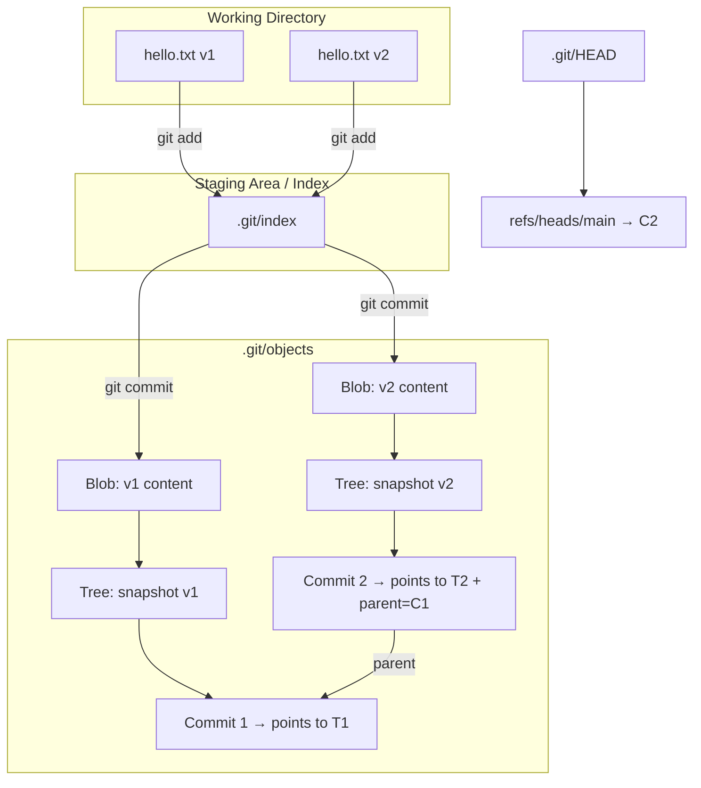

# Exploring the `.git` Folder (Hands-On)

In this exercise, we’ll create a repo, peek inside the `.git` folder, and see how Git’s versioning works.

---

## Step 1: Initialize a Repository

```bash
mkdir git-demo
cd git-demo
git init
```

Output:

```
Initialized empty Git repository in /path/to/git-demo/.git/
```

Now, check the hidden `.git` folder:

```bash
ls -la
```

You’ll see something like:

```
.   ..   .git
```

---

## Step 2: Look Inside `.git`

```bash
ls -la .git
```

Typical contents:

```
HEAD
config
description
hooks/
info/
objects/
refs/
```

---

## Step 3: Create a File

```bash
echo "Hello Git" > hello.txt
git status
```

Git says:

```
Untracked files:
  (use "git add <file>..." to include in what will be committed)
        hello.txt
```

At this point:
- `hello.txt` is in the **working directory**.
- Nothing in `.git/` has changed yet.

---

## Step 4: Stage the File

```bash
git add hello.txt
git status
```

Output:

```
Changes to be committed:
  new file:   hello.txt
```

Now check `.git/index`:

```bash
ls -l .git/index
```

- This file is the **staging area**.  
- It now tracks `hello.txt` so it’s ready for commit.

---

## Step 5: Commit the File

```bash
git commit -m "Add hello.txt"
```

Output:

```
[main (root-commit) abc1234] Add hello.txt
 1 file changed, 1 insertion(+)
 create mode 100644 hello.txt
```

Now explore `.git/objects`:

```bash
ls .git/objects
```

You’ll see hashed directories (e.g., `ab/`, `cd/`).  
Inside them, Git stores compressed objects:
- **Blob** = file content (`hello.txt`).
- **Tree** = directory structure.
- **Commit** = metadata + snapshot reference.

---

## Step 6: Inspect `HEAD`

```bash
cat .git/HEAD
```

You’ll see:

```
ref: refs/heads/main
```

This means `HEAD` is pointing to the latest commit on the `main` branch.

---

## Step 7: View Commit History

```bash
git log --oneline
```

Output:

```
abc1234 (HEAD -> main) Add hello.txt
```

- The commit hash (`abc1234`) matches what’s stored in `.git/refs/heads/main`.  

Check it:

```bash
cat .git/refs/heads/main
```

This shows the **commit hash** that the branch pointer is tracking.

---

## Step 8: Modify a File

```bash
echo "This is version 2" >> hello.txt
git status
```

Output:

```
Changes not staged for commit:
  modified:   hello.txt
```

---

## Step 9: Stage the Change

```bash
git add hello.txt
git status
```

Now it says:

```
Changes to be committed:
  modified:   hello.txt
```

The change is tracked in `.git/index`.

---

## Step 10: Commit the Change

```bash
git commit -m "Update hello.txt to version 2"
```

Output:

```
[main 456def7] Update hello.txt to version 2
 1 file changed, 1 insertion(+)
```

---

## Step 11: Explore the Objects

```bash
ls .git/objects
```

You’ll see more object directories (hash prefixes).  
Each new commit adds:
- A **blob object** for the new file version.
- A **tree object** for the directory snapshot.
- A **commit object** pointing to the new tree (and the previous commit).

---

## Step 12: View History

```bash
git log --oneline
```

Output:

```
456def7 (HEAD -> main) Update hello.txt to version 2
abc1234 Add hello.txt
```

Now, `HEAD` has moved to the new commit.

Check again:

```bash
cat .git/HEAD
```

```
ref: refs/heads/main
```

And:

```bash
cat .git/refs/heads/main
```

Shows the hash of the latest commit (`456def7`).

---

## Visual Diagram of Versioning



## What Each Part Means

### WD (Working Directory)
- **F1** = first version of `hello.txt`  
- **F2** = second version of `hello.txt`  

### ST (Staging Area / Index)
- **IDX** = snapshot of what’s staged (what will be committed)  

### OBJ (.git/objects)
- **B1** = **Blob object** storing content of `hello.txt v1`  
- **B2** = **Blob object** storing content of `hello.txt v2`  
- **T1** = **Tree object** describing the directory at commit 1 (points to `B1`)  
- **T2** = **Tree object** describing the directory at commit 2 (points to `B2`)  
- **C1** = **Commit object #1**, pointing to `T1`  
- **C2** = **Commit object #2**, pointing to `T2` and linking back to `C1` as its parent  

### HEAD & refs
- **HEAD** = pointer to the current branch  
- **refs/heads/main** = file in `.git/refs/heads/` that points to the latest commit hash (`C2` here)  

---

## Workflow of the Diagram

### 1. First Commit (C1)
1. `hello.txt v1` staged → Git creates **blob B1**.  
2. Git makes a **tree T1** recording "`hello.txt` → `B1`".  
3. Git creates **commit C1** pointing to `T1`.  
4. `HEAD` points to `C1`.  

### 2. Second Commit (C2)
1. File modified → `hello.txt v2` staged → Git creates **blob B2**.  
2. Git makes a **tree T2** recording "`hello.txt` → `B2`".  
3. Git creates **commit C2** pointing to `T2`, and linking back to `C1` (its parent).  
4. `HEAD` moves to `C2`.  

---

## Key Takeaways

1. **`.git/index`** = staging area.  
2. **`.git/objects/`** = database of all commits, files, and trees.  
3. **`.git/HEAD`** = pointer to the current branch.  
4. **`.git/refs/heads/*`** = branch pointers to commits.  
5. Git versioning = snapshots stored as objects, not diffs.  
