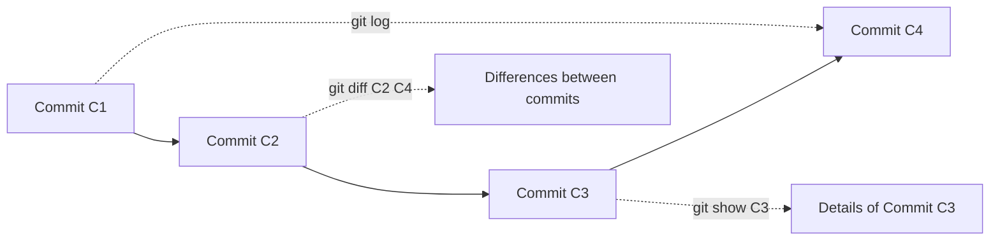

# Exploring Git Commit History  

Understanding your commit history is one of the most important parts of working with Git.  
We’ll look at three key commands:  

- `git log` → view commit history  
- `git show` → inspect details of a commit  
- `git diff` → see what changed between commits, or in your working directory  

---

## 1. `git log`

`git log` shows the commit history in reverse chronological order (latest commits first).  

### Basic usage:
```bash
git log
```

### Common flags:
- `--oneline` → compact view (1 line per commit)  
- `--graph` → ASCII graph of branches/merges  
- `--decorate` → shows branch and tag names next to commits  
- `-p` → shows patch (diff) for each commit  
- `--stat` → shows files changed, insertions, deletions  

### Examples:
```bash
git log --oneline
git log --oneline --graph --decorate
git log --stat
```

### Example output:
```text
* 9a1f23d (HEAD -> main, origin/main) Add README diagram
* b12c45e Fix typo in installation instructions
* 7f8a912 Initial commit with project setup
```

With `--graph --decorate`:
```text
* 9a1f23d (HEAD -> main, origin/main) Add README diagram
| * e3f8c76 (feature-branch) Implement login form
|/
* b12c45e Fix typo in installation instructions
* 7f8a912 Initial commit with project setup
```

---

## 2. `git show`

`git show` displays detailed information about a single commit.  
By default, it shows the commit message, author, date, and the patch (diff).  

### Basic usage:
```bash
git show <commit-hash>
```

### Common flags:
- `--stat` → summary of files changed  
- `--name-only` → list only filenames changed  
- `--name-status` → filenames + added/modified/deleted  
- `-p` → show the patch (default behavior)  

### Examples:
```bash
git show HEAD
git show --stat HEAD~1
git show --name-only <commit-hash>
```

### Example output:
```text
commit 9a1f23d3c45e98a12345abcde67890f123456789 (HEAD -> main, origin/main)
Author: John Doe <john@example.com>
Date:   Fri Sep 27 14:32:10 2024 +0530

    Add README diagram

 readme.md | 5 +++++
 1 file changed, 5 insertions(+)
```

---

## 3. `git diff`

`git diff` shows the line-by-line differences between files.  

### Common scenarios:
- **Working Directory → Staging Area**  
  ```bash
  git diff
  ```
  (changes not yet staged)

- **Staging Area → Last Commit**  
  ```bash
  git diff --cached
  ```
  (changes staged but not committed)

- **Between commits**  
  ```bash
  git diff <commit1> <commit2>
  ```

- **With flags**:  
  - `--stat` → summary of changes  
  - `--name-only` → only file names  
  - `--name-status` → file names + status  

### Examples:
```bash
git diff
git diff --cached
git diff HEAD~1 HEAD
git diff --stat <commit1> <commit2>
```

### Example output:
```diff
diff --git a/readme.md b/readme.md
index 2d3ac12..a7f6c45 100644
--- a/readme.md
+++ b/readme.md
@@ -1,3 +1,5 @@
 # Project Repo
 Initial setup instructions

+## New Section
+Added a diagram to explain workflow
```

---

## 🖼️ Visualizing Commit History  



---

## Summary  

- Use **`git log`** to browse history (with `--oneline`, `--graph`, etc.)  
- Use **`git show`** to inspect a specific commit  
- Use **`git diff`** to compare commits or see changes not yet committed  
 
