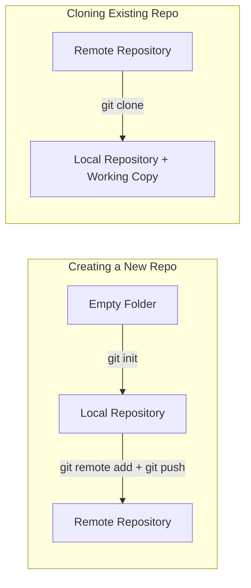

## Creating New Repositories vs Cloning Existing Ones

When starting with Git, there are **two main ways** to set up a repository:

1. **Creating a new repo (`git init`)** → starting from scratch.  
2. **Cloning an existing repo (`git clone`)** → copying an already existing project.  

---

### 1. Creating a New Repository

Use this when you’re starting a project from zero.

#### Steps:
```bash
# Step 1: Create a folder for your project
mkdir my-project
cd my-project

# Step 2: Initialize Git
git init

# Step 3: Verify Git created the .git folder
ls -a
```

#### What happens?
- A hidden `.git/` folder is created (this contains all repo history & config).
- Your folder is now a **local Git repository**.
- You can add files, commit them, and later connect to a remote repo.

#### Example workflow:
```bash
echo "# My Project" > README.md
git add README.md
git commit -m "Initial commit"
```

---

### 2. Cloning an Existing Repository

Use this when you want to **work on a project that already exists** (on GitHub, GitLab, Bitbucket, etc.).

#### Steps:
```bash
# Clone using HTTPS
git clone https://github.com/user/repo.git

# Or using SSH
git clone git@github.com:user/repo.git
```

#### What happens?
- Git downloads the entire repository (history + files).
- A folder with the repo name is created.
- You get a **working copy** and are automatically connected to the remote.

---

### Key Differences

| Feature | `git init` (new repo) | `git clone` (existing repo) |
|---------|-----------------------|-----------------------------|
| Starting point | Blank project | Existing project |
| Remote linked? | No (you add later with `git remote add`) | Yes (remote automatically linked) |
| History | Starts empty | Full history from remote |
| Use case | New project | Contributing to or using an existing project |

---

### Visual Diagram



---

### Summary

- **`git init`** → You’re starting **from scratch**.  
- **`git clone`** → You’re copying **an existing project** with its history.  
- Both give you a local Git repo, but cloning saves you setup time because the remote is already linked.  

👉 If you’re creating your **own project**, use `git init`.  
👉 If you’re **joining someone else’s project**, use `git clone`.  
