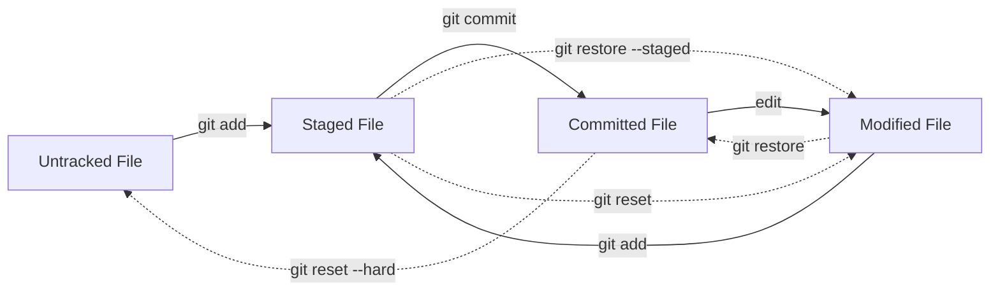

## Git File States: Untracked, Staged, Committed, Modified

In Git, every file in your project exists in **one of four main states**:

1. **Untracked** – Git doesn’t know about the file yet.  
2. **Staged** – File is added to the “staging area” and will be included in the next commit.  
3. **Committed** – File is saved into the Git history inside the local repository.  
4. **Modified** – A tracked (committed) file has been changed but not yet staged.

---

### 1. Untracked Files
- Newly created files that Git does not yet manage.  
- They won’t be part of commits until staged.  

```bash
echo "Hello Git" > hello.txt
git status
```

👉 `hello.txt` appears as **untracked**.

---

### 2. Staged Files
- Files added to the **staging area (index)**.  
- They will be included in the **next commit**.  

```bash
git add hello.txt
git status
```

👉 Now `hello.txt` is **staged**.

---

### 3. Committed Files
- Staged files become part of the repository history after committing.  

```bash
git commit -m "Add hello.txt"
git status
```

👉 `hello.txt` is now **committed**.

---

### 4. Modified Files
- If you change a tracked file, Git marks it as **modified**.  
- Modified files are not yet staged.  

```bash
echo "New line" >> hello.txt
git status
```

👉 `hello.txt` is now **modified**.  
- To save it again:  
- `git add hello.txt` → staged  
- `git commit -m "Update hello.txt"` → committed  

---

### Workflow Example

```bash
git init

# Step 1: Create a file (Untracked)
echo "print('Hello')" > app.py
git status   # app.py is untracked

# Step 2: Stage the file
git add app.py
git status   # app.py is staged

# Step 3: Commit the file
git commit -m "Add app.py"
git status   # working tree clean

# Step 4: Modify the file
echo "print('New Feature')" >> app.py
git status   # app.py is modified

# Step 5: Stage & Commit again
git add app.py
git commit -m "Update app.py"
```

---

### Undoing Changes: `git restore` & `git reset`

Sometimes you need to **go backwards** in the cycle. Git provides two important commands:

### `git restore`
- Undo changes in **working directory**.  
- If a file is modified but you don’t want to keep the changes:  

```bash
git restore hello.txt   # discard modifications, restore last committed version
```

- If a file is staged but you want to unstage it:  

```bash
git restore --staged hello.txt   # moves file back from staged → modified
```

---

### `git reset`
- Moves commits or staged files **backwards in history**.  

1. **Unstage files** (without touching working directory):  
```bash
git reset hello.txt   # staged → modified
```

2. **Reset to a previous commit (soft reset)** – keeps changes in working dir:  
```bash
git reset --soft HEAD~1
```

3. **Hard reset** – moves HEAD back and discards changes permanently:  
```bash
git reset --hard HEAD~1
```

⚠️ Be careful: `--hard` is destructive.

---

### Visual Diagram of Git File Lifecycle



---

### Summary

- **Untracked** → new file, not under Git control.  
- **Staged** → file ready for commit.  
- **Committed** → file safely stored in repo history.  
- **Modified** → file changed after commit, not yet staged.  
- **git restore** → undo modifications / unstage files.  
- **git reset** → roll back commits or unstages files (more powerful).  

👉 Typical cycle:  
`Untracked → Staged → Committed → Modified → Staged → Committed …`  
With **restore/reset**, you can jump backwards in this flow.
