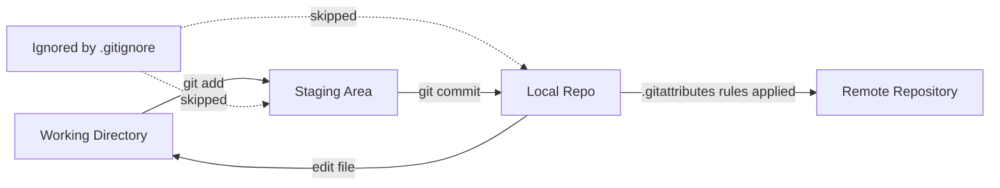

## Ignoring Files with `.gitignore` and Understanding `.gitattributes`

### Ignoring Files with `.gitignore`

`.gitignore` tells Git which files/folders **not to track**. This helps keep your repository clean by avoiding unnecessary or sensitive files being committed.

### Common Use Cases
- Temporary or cache files (e.g., `*.log`)
- Build artifacts (e.g., `/dist/`)
- OS/editor-specific files (e.g., `.DS_Store`, `.vscode/`)

### Example `.gitignore`

```gitignore
# Ignore all .log files
*.log

# Ignore build directory
/build/

# Ignore OS files
.DS_Store

# Ignore editor configs
.vscode/
```

### Useful Commands

```bash
# Check ignored files
git status --ignored

# Force add a file even if ignored
git add -f filename.log
```

---

### Understanding `.gitattributes`

`.gitattributes` defines **how Git treats certain files**.  
It can control:
- Text vs binary detection
- End-of-line (EOL) normalization
- Merge strategies
- Diff customization
- Export behaviors

### Example `.gitattributes`

```gitattributes
# Normalize text files to use LF (Unix style)
*.txt text eol=lf

# Force CRLF (Windows style) for batch files
*.bat text eol=crlf

# Treat images as binary (no diffs shown)
*.jpg binary

# Use custom diff driver for Markdown files
*.md diff=markdown
```

---

### Key Uses of `.gitattributes`

1. **Line Endings (EOL Normalization)**  
   Prevents issues between Windows (CRLF) and Linux/macOS (LF).  

   Example:
   ```gitattributes
   * text=auto
   ```

2. **Binary vs Text**  
   Git can skip diffs/merges for binary files:
   ```gitattributes
   *.png binary
   ```

3. **Custom Diff Drivers**  
   Assign special rules for file types:
   ```gitattributes
   *.md diff=markdown
   ```

4. **Merge Strategies**  
   You can tell Git to always keep “ours” or “theirs” during merges:
   ```gitattributes
   config.json merge=ours
   ```

---

### Mermaid Diagram: How Git Processes Files



###  Explanation of Diagram
1. **Working Directory** → staging area for normal files.  
2. **Ignored files (`.gitignore`)** → skipped from staging and committing.  
3. **Staged files** → committed to local repository.  
4. **Git Attributes (`.gitattributes`)** → rules applied during commit and push.  
5. **Local repo changes** → pushed to remote repository.  

---

### Summary

- `.gitignore` → *What Git should **not track***.  
- `.gitattributes` → *How Git should **handle files*** (EOL, binary/text, diffs, merges).  
