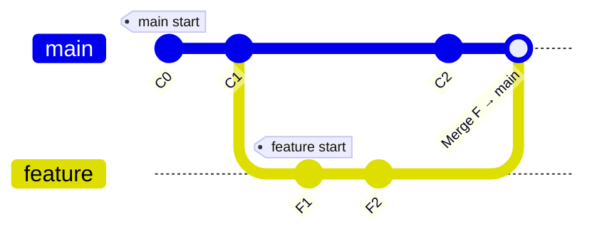

## Git Branches — What They Are and Why They Matter

### What Are Branches?

A **branch** in Git is simply a **movable pointer** to a specific commit in the project’s history.  
Think of it as a **timeline** or **independent line of development** within your repository.

By default, when you create a new Git repository, Git makes a **main** (or **master**) branch.  
You can then create new branches to work on features, fixes, or experiments **without affecting** the main codebase.

Each branch:
- Points to the **latest commit** in that line of development.
- Moves forward automatically as new commits are made.
- Keeps your work **isolated**, safe, and easy to integrate later.

---

###  Why Branches Matter

Branches are crucial because they enable:

1. **Parallel Development** — multiple developers can work on different features simultaneously.  
2. **Experimentation Without Risk** — try ideas safely in a separate branch.  
3. **Clean Collaboration** — organize your changes in feature or fix branches.  
4. **Safe Integration** — test and review before merging into main.  
5. **Version Isolation** — each branch keeps its own history.

---

### Mermaid Diagram — Branching Concept

---

### Diagram Explanation

Let’s break it down step by step:

1. **C0 → C1 (main branch)**  
   - Work begins on the main branch.  
   - You make a couple of commits (`C0`, `C1`) — the default branch Git creates for you.  

2. **Branch creation: `feature`**  
   - At commit `C1`, a new branch named `feature` is created.  
   - Both `main` and `feature` point to the same commit initially.

3. **Switch to `feature` branch**  
   - Now the HEAD (your active pointer) moves to `feature`.  
   - Any new commits will only affect this branch.  

4. **Commits on `feature` branch (`F1`, `F2`)**  
   - Two new commits are added.  
   - The `feature` branch now diverges from `main`.

5. **Checkout `main` and add `C2`**  
   - You switch back to `main`.  
   - You add a new commit (`C2`) — this extends the main branch independently of `feature`.

6. **Merge `feature` → `main`**  
   - Finally, `feature` is merged into `main`.  
   - Now both contain all the commits from both lines of development.

---

### Summary

| Concept | Description |
|----------|--------------|
| **Branch** | A pointer to a commit (a separate line of development). |
| **Main branch** | The primary, stable version of your code. |
| **Feature branch** | A branch used to add new functionality without disturbing main. |
| **Merging** | Combining changes from one branch into another. |
| **Isolation** | Each branch can evolve independently. |
