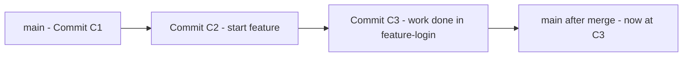
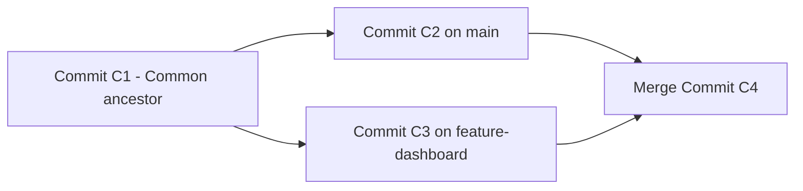

## Fast-Forward vs Three-Way Merge

When working with branches in Git, **merging** is how you combine changes from one branch into another.  
There are two main types of merges:

- **Fast-Forward Merge**
- **Three-Way Merge**

---

## Fast-Forward Merge

### Concept

If **no new commits** were made on the `main` branch since you branched off,  
Git can simply **move the branch pointer forward** — no new merge commit is needed.

It’s like:  
> “Nothing changed in main, so I’ll just fast-forward its pointer to include all your commits.”

### Example

```bash
# You create a new branch from main
git checkout -b feature-login

# You make changes and commit
git add .
git commit -m "Add login feature"

# Now main hasn't changed, so merging is simple
git checkout main
git merge feature-login
```

💡 Result: Git **just moves the `main` pointer forward** to include the feature branch’s commits — no new “merge commit” is created.



### What’s Happening

1. **Commit C1**  
   You start with one branch, `main`, pointing to commit **C1**.

2. **Create a new branch**  
   ```bash
   git checkout -b feature-login
   ```
   This creates a new branch `feature-login` pointing to **C1**.

3. **Work on feature branch**  
   You make commits (`C2`, `C3`) — for example, adding a login form and fixing a bug.  
   Now:
   - `feature-login` → points to **C3**
   - `main` → still at **C1**

4. **Merge back into main**  
   Since `main` hasn’t changed, Git simply **moves the `main` pointer forward** to point to `C3`.  
   No merge commit is needed — Git just “fast-forwards” the branch pointer.

---

### Key Takeaways

| Concept | Description |
|----------|--------------|
| **Fast-forward merge** | Happens when `main` has not diverged — Git can move the pointer directly. |
| **No new commit** | Just updates `main` to point to the latest commit. |
| **Linear history** | Keeps the project history simple and clean. |

---

## Three-Way Merge

### Concept

If **both branches** have new commits, Git can’t just fast-forward.  
Instead, it performs a **three-way merge** between:

1. The **common ancestor** (where the branch split)  
2. The **last commit on main**  
3. The **last commit on your feature branch**

Git combines these into a new **merge commit** that ties both histories together.

### Example

```bash
# You create a branch
git checkout -b feature-dashboard

# Meanwhile, someone updates main
git checkout main
git commit -m "Update README"

# Now merge your branch
git merge feature-dashboard
```

Git now compares:
- **Base commit** (where both branches started)
- **main’s latest commit**
- **feature-dashboard’s latest commit**

It creates a **new merge commit** to combine both.



### What’s Happening

1. **Start from C1 (common ancestor)**  
   Both `main` and `feature-dashboard` start from commit **C1**.

2. **Main branch moves ahead**  
   Someone adds new work → `main` now points to **C2**.

3. **Feature branch also moves ahead**  
   You add commits in your branch → `feature-dashboard` now points to **C3**.

4. **Branches have diverged**  
   - `main` → `C2`  
   - `feature-dashboard` → `C3`  
   They share a **common ancestor** (`C1`).

5. **Merging the branches**  
   When you run:
   ```bash
   git checkout main
   git merge feature-dashboard
   ```
   Git performs a **three-way merge** between:
   - `C1` (base – common ancestor)
   - `C2` (tip of main)
   - `C3` (tip of feature)

   It creates a new **merge commit (C4)** that combines changes from both branches.

---

### Key Takeaways

| Concept | Description |
|----------|--------------|
| **Three-way merge** | Happens when branches have diverged (different commits). |
| **New merge commit** | A new commit (e.g., C4) is created to combine both histories. |
| **History is non-linear** | Shows branching and merging in project history. |
| **Conflict resolution** | If both branches modified the same lines, Git asks you to resolve conflicts manually. |


---

### Difference Summary

| Feature | Fast-Forward Merge | Three-Way Merge |
|----------|--------------------|-----------------|
| When Used | Main branch has **no new commits** | Main branch **has new commits** |
| Creates New Commit? | ❌ No | ✅ Yes (merge commit) |
| Keeps History Linear? | ✅ Yes | ❌ No (has a merge node) |
| Command | `git merge feature` | `git merge feature` (Git decides automatically) |
| Example Use | Small quick feature | Long-running feature branch |

---

### Quick Tip

If you want Git to **always create a merge commit** (even when fast-forward is possible), use:

```bash
git merge --no-ff feature-branch
```

This keeps a visible history of all merges — great for large teams.

---

### Summary

- **Fast-forward merge** → main hasn’t moved → pointer just moves forward.  
- **Three-way merge** → both branches changed → Git creates a new merge commit.  
- Both methods combine work, but differ in **how history is represented**.
