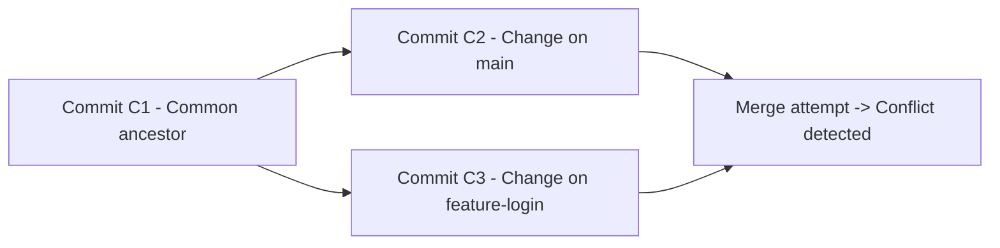

## Merge Conflicts in Git — How to Identify and Resolve

When merging branches in Git, sometimes **the same part of a file is modified in two branches**.  
Git can’t automatically decide which version to keep — this is called a **merge conflict**.

---

### What Causes Merge Conflicts

A **merge conflict** occurs when:
- Two branches **edit the same line** in a file.
- One branch **deletes a file** that another branch **modifies**.
- Git can’t automatically decide which version is correct.

---

### Example Scenario

1. You and your teammate both start from the same commit (**C1**).
2. You create a branch called `feature-login` and modify `index.html`.
3. Your teammate updates the same line in `main` and commits (**C2**).
4. When you try to merge your feature branch back into main — **Git detects a conflict**.

---



---

### Identifying a Merge Conflict

When you run:

```bash
git merge feature-login
```

Git will stop the merge and show a message like:

```
Auto-merging index.html
CONFLICT (content): Merge conflict in index.html
Automatic merge failed; fix conflicts and then commit the result.
```

---

### What Happens in the File

Git marks the conflict directly **inside the file**, like this:

```html
<<<<<<< HEAD
<p>Welcome to our website!</p>
=======
<p>Welcome to the login portal!</p>
>>>>>>> feature-login
```

### Here’s what each part means:
- `<<<<<<< HEAD` → Your current branch (e.g., `main`)
- `=======` → Separator between conflicting changes
- `>>>>>>> feature-login` → Incoming branch being merged

---

### How to Resolve the Conflict

You need to **edit the file manually** to decide what to keep.

For example, you might change it to:

```html
<p>Welcome to our website! Please log in.</p>
```

Then mark it as resolved:

```bash
git add index.html
git commit
```

💡 The commit message will automatically include something like:
```
Merge branch 'feature-login'
```

---

### Useful Commands for Merge Conflicts

| Command | Description |
|----------|--------------|
| `git status` | Lists files with conflicts |
| `git diff` | Shows conflict details |
| `git merge --abort` | Cancels the merge and restores the branch to pre-merge state |
| `git log --merge` | Shows commits causing the conflict |
| `git checkout --ours <file>` | Keeps **your** version (current branch) |
| `git checkout --theirs <file>` | Keeps **incoming** version (merged branch) |

---

### Example Workflow

```bash
# Start a merge
git merge feature-login

# Git reports conflicts
git status

# Edit conflicted files manually to resolve
nano index.html

# Mark conflicts as resolved
git add index.html

# Finalize the merge
git commit
```

---

### Summary

| Concept | Description |
|----------|--------------|
| **What is it?** | When Git can’t auto-merge changes |
| **Where it appears?** | Inside the file, marked by `<<<<<<<` and `>>>>>>>` |
| **How to fix?** | Edit manually, choose correct lines, and `git add` + `git commit` |
| **Tools help** | IDEs like VS Code, GitKraken, or SourceTree can highlight and simplify conflict resolution |

---

### Quick Tip

If you want to avoid frequent conflicts:
- **Pull often** from `main` before you start new work.
- **Communicate** with teammates about shared files.
- **Keep commits small and focused** to reduce overlap.
