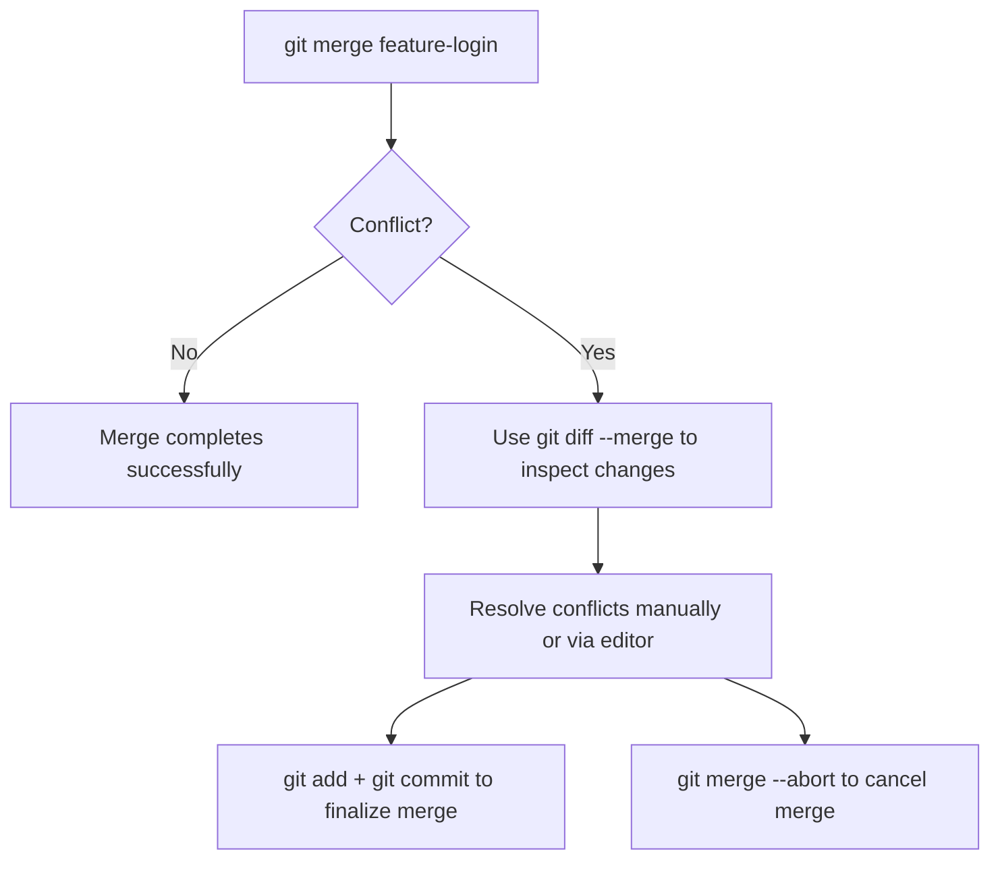

## Git Merge Conflict Tools — `git merge --abort` and `git diff --merge`

When a merge conflict happens, Git pauses the merge process and lets you decide what to do next.  
Two very useful commands in this situation are **`git merge --abort`** and **`git diff --merge`**.

---

### `git merge --abort`

### Purpose
Cancels an ongoing merge and **restores your branch** to the exact state it was in **before** you started merging.

### When to Use
You should use this when:
- The merge produced too many conflicts.
- You want to start the merge over from scratch.
- You realize you merged the wrong branch.

### Example

```bash
# Start a merge
git merge feature-login

# Conflict happens...
Auto-merging index.html
CONFLICT (content): Merge conflict in index.html

# Abort the merge and return to previous state
git merge --abort
```

After this, your branch will be exactly as it was before running the merge command —  
no conflicted files, no partial changes.

---

### What Happens Internally

When you run `git merge`, Git temporarily records merge state information in:
- `.git/MERGE_HEAD`
- `.git/MERGE_MSG`

Running `git merge --abort` removes these files and **resets the working directory** and **staging area** to the last committed state.

---

### `git diff --merge`

###  Purpose
Shows **differences between conflicting versions** of a file during a merge.

This command helps you see:
- What **your branch (ours)** changed.
- What **the incoming branch (theirs)** changed.
- The **common ancestor** version of the file.

---

### Example

```bash
# During a merge conflict
git diff --merge
```

This outputs a **three-way diff** for each file in conflict, showing:
1. **Base version** (common ancestor)
2. **Your version (ours)** — from the current branch
3. **Incoming version (theirs)** — from the branch being merged

---

### How It Helps

- You can visually inspect what changed in both branches.
- Helps you **decide which version** (or combination) to keep.
- Useful before editing the file manually or using GUI tools.

---

### Related Commands for Conflict Resolution

| Command | Description |
|----------|--------------|
| `git status` | Lists conflicted files |
| `git diff` | Shows detailed differences between files |
| `git merge --abort` | Stops merge and restores to pre-merge state |
| `git diff --merge` | Shows 3-way diff for conflicted files |
| `git log --merge` | Shows commits involved in current merge |
| `git restore --staged <file>` | Unstages a file if added prematurely |
| `git checkout --ours <file>` | Keep your version |
| `git checkout --theirs <file>` | Keep the other branch’s version |

---

### Quick Example Workflow

```bash
# Start a merge
git merge feature-login

# Conflict happens
git status

# Review differences
git diff --merge

# Decide to abort the merge
git merge --abort
```

---

### Summary

| Command | Purpose |
|----------|----------|
| `git merge --abort` | Safely cancel an in-progress merge and restore your branch |
| `git diff --merge` | View detailed 3-way diff to understand conflicts |

---

### Visualization



---

### Tip

If you’re unsure about a merge, **always inspect with `git diff --merge` before committing**,  
and if things get messy, **`git merge --abort` is your safe exit door**.

---
