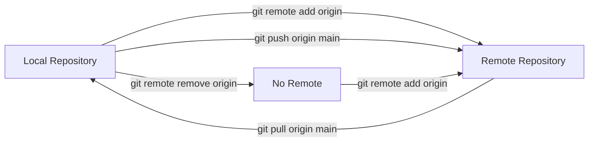

## Adding and Removing Remotes in Git

### What Are Remotes?

In Git, a **remote** is a link to another version of your repository — usually on GitHub, GitLab, or Bitbucket.  
It acts as a *pointer* to the place where your local repo can **push** or **pull** changes.

Think of it like this:
>  Your local repository = your personal workspace  
>  Remote repository = the shared online version (on GitHub)

---

### Checking Existing Remotes

To see all remotes linked to your local repository:

```bash
git remote -v
```

Example output:
```
origin  https://github.com/username/my-project.git (fetch)
origin  https://github.com/username/my-project.git (push)
```

Here:
- **origin** → the remote name (default when you clone)
- The URL → where your project lives on GitHub

---

### Adding a Remote

If you’ve just created a **local Git repo** and want to connect it to a **remote (e.g., GitHub)**, use:

```bash
git remote add origin https://github.com/username/repo-name.git
```

✅ **Explanation:**
- `git remote add` → tells Git you want to add a remote  
- `origin` → a short name for the remote (can be anything, but “origin” is standard)
- URL → location of your remote repo

To verify:
```bash
git remote -v
```

💡 **Tip:** You can have multiple remotes — for example:
```bash
git remote add backup https://gitlab.com/username/repo-name.git
```

Now you can push to either:
```bash
git push origin main
git push backup main
```

---

### Renaming a Remote

If you want to rename a remote (for example, from `origin` to `github`):

```bash
git remote rename origin github
```

Now check:
```bash
git remote -v
```

Output:
```
github  https://github.com/username/repo-name.git (fetch)
github  https://github.com/username/repo-name.git (push)
```

---

### Changing the Remote URL

If you need to update the remote’s URL (e.g., you moved from HTTPS to SSH):

```bash
git remote set-url origin git@github.com:username/repo-name.git
```

Check to confirm:
```bash
git remote -v
```

💡 **Common use case:**  
Switching from HTTPS to SSH authentication.

---

### Removing a Remote

To completely remove a remote from your repository:

```bash
git remote remove origin
```

or (older syntax):
```bash
git remote rm origin
```

Now verify:
```bash
git remote -v
```
👉 You’ll see no remotes listed.

---

### Example Workflow

Let’s go through a real-world example.

```bash
# Initialize a new Git repo
git init

# Add your files and commit
git add .
git commit -m "Initial commit"

# Add a remote origin (GitHub repo)
git remote add origin https://github.com/johndoe/myproject.git

# Push your code to GitHub
git push -u origin main

# Later, if you want to switch to SSH
git remote set-url origin git@github.com:johndoe/myproject.git

# To check your remotes
git remote -v

# To remove a remote
git remote remove origin
```

---

### Visual Overview




**Explanation:**

1. The **local repository** connects to a **remote repository** using `git remote add`.  
2. You can **push** changes from local → remote and **pull** from remote → local.  
3. Using `git remote remove`, you disconnect the remote link.

---

### Summary

| Command | Purpose |
|----------|----------|
| `git remote -v` | View all remotes |
| `git remote add <name> <url>` | Add a new remote |
| `git remote rename <old> <new>` | Rename a remote |
| `git remote set-url <name> <url>` | Change the remote’s URL |
| `git remote remove <name>` | Remove a remote |

---

### Notes

- “origin” is just a **nickname** for your remote; you can name it anything.
- You can have **multiple remotes** (GitHub, GitLab, Bitbucket, etc.).
- You only need to add a remote **once per repository** — not for every push.
