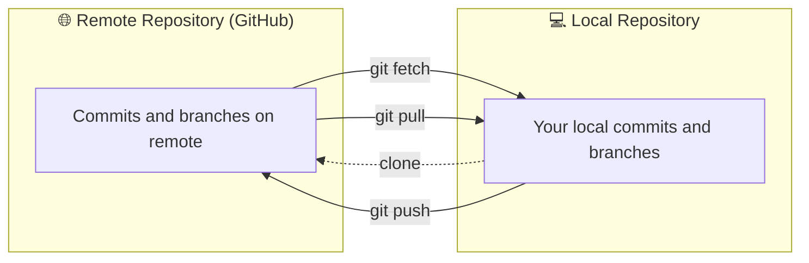

## Git Fetch vs Pull vs Clone vs Push

### Overview

These four commands — `fetch`, `pull`, `clone`, and `push` — are essential for working with **remote repositories**.  
They control how data moves **between your local repository and remote repositories** (like GitHub).

---

### Summary Table

| Command | Direction | What It Does | Creates Commits? | Typical Use |
|----------|------------|---------------|------------------|--------------|
| `git clone` |  Remote → Local | Copy a **remote repo** into a new local folder | ✅ (initial) | Start working on an existing repo |
| `git fetch` |  Remote → Local | Get the **latest commits** from remote (no merge) | ❌ | See what others have done |
| `git pull` |  Remote → Local | Fetch + Merge (updates your branch) | ✅ | Update local branch with remote |
| `git push` |  Local → Remote | Upload local commits to remote | ❌ | Share your changes |

---

### 1. `git clone`

### Concept
Copies an **entire remote repository** (all files, history, branches) into a new local directory.

```bash
git clone https://github.com/username/repo.git
```

Creates:
- A new folder with all files.
- A remote named `origin`.
- A checked-out default branch (usually `main`).

---

### 2. `git fetch`

### Concept
Downloads **new commits** and **branch updates** from the remote repository, but **doesn’t change** your working files or local branches.

```bash
git fetch origin
```

Use this to preview what’s new before merging:
```bash
git log HEAD..origin/main
```

---

### 3. `git pull`

### Concept
A **two-step command**:  
1. `git fetch` → downloads changes
2. `git merge` → merges those changes into your current branch

```bash
git pull origin main
```

If your branch is behind, Git merges the remote changes.  
If there are conflicts, you’ll need to resolve them manually.

---

### 4. `git push`

### Concept
Uploads your **local commits** to the remote repository.  

```bash
git push origin main
```

If you’re pushing for the first time:
```bash
git push -u origin main
```
The `-u` flag sets `origin/main` as the default upstream branch, so next time you can just run:
```bash
git push
```

---

### Visual Overview



---

### Quick Recap

| Action | Command | Effect |
|--------|----------|---------|
| Get a copy of a repo | `git clone <url>` | Makes a new local copy |
| See remote updates | `git fetch` | Downloads commits but doesn’t merge |
| Update local branch | `git pull` | Fetch + Merge |
| Upload local commits | `git push` | Sends your work to the remote |

---

### Pro Tip

If you only want to **inspect** remote updates before merging, prefer:

```bash
git fetch origin
git diff main origin/main
```

This shows differences without changing your local branch.
