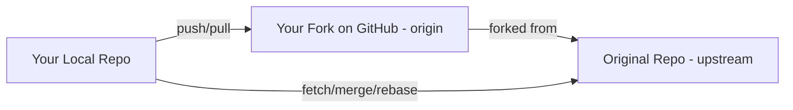

## Git Remotes — Origin vs Upstream

When collaborating with Git and GitHub, you’ll often encounter terms like:

- `origin`  
- `upstream`  
- `fetch`, `pull`, `push`, `clone`

They all relate to **remote repositories** — versions of your project stored on GitHub or another server.

Let’s break it all down from scratch 👇

---

### What Are Remotes?

A **remote** is simply a **reference (nickname)** for a Git repository stored somewhere else.

Your local repository can have **one or many remotes**, each pointing to a different Git URL.

You can list your remotes using:

```bash
git remote -v
```

---

### Common Remote Names

| Remote Name | Typical Meaning | When You Use It |
|--------------|-----------------|-----------------|
| **origin** | The **default remote** created when you clone a repository | You push/pull from your own repo |
| **upstream** | The **original source repository** you forked from | You fetch new changes from it to stay up-to-date |
| **fork** | Your **personal copy** of someone’s repo (on GitHub) | You clone this locally to contribute |
| **downstream** | (less common) A **repo pulling from you** | Used in multi-team workflows or mirrored setups |

---

### Real-World Example: Fork → Clone → Upstream Sync → PR

Let’s imagine a real workflow for an **open-source project**:

- The original project lives at:  
  `https://github.com/org/project`
- You fork it to your GitHub:  
  `https://github.com/you/project`
- You clone **your fork** locally.
- You then add an **upstream remote** to keep your fork synced.

Here’s the step-by-step setup 👇

---

### Step 1: Fork and Clone

You click **Fork** on GitHub → this creates a copy under your account.

```bash
# Clone your fork (GitHub automatically names it 'origin')
git clone https://github.com/you/project.git
cd project

# Check your remotes
git remote -v
```

Output:
```
origin  https://github.com/you/project.git (fetch)
origin  https://github.com/you/project.git (push)
```

---

### Step 2: Add the Original Repo as `upstream`

Now add the **main/original repo** as your upstream remote:

```bash
git remote add upstream https://github.com/org/project.git
```

Verify it worked:

```bash
git remote -v
```

Output:
```
origin    https://github.com/you/project.git (fetch)
origin    https://github.com/you/project.git (push)
upstream  https://github.com/org/project.git (fetch)
upstream  https://github.com/org/project.git (push)
```

---

### Step 3: Keeping Your Fork Updated

Fetch the latest changes from the upstream repo:

```bash
git fetch upstream
```

Then, merge those updates into your local main branch:

```bash
git checkout main
git merge upstream/main
```

or rebase instead (to keep a linear history):

```bash
git checkout main
git rebase upstream/main
```

Push the updated branch to your fork:

```bash
git push origin main
```

---

### Step 4: Making Contributions (Feature Branch Workflow)

When you want to work on a new feature:

```bash
git checkout -b feature/new-login
# make your changes
git add .
git commit -m "Add new login feature"
git push origin feature/new-login
```

Then, go to GitHub and open a **Pull Request (PR)** from  
`you:feature/new-login` → `org:main`.

---

### Diagram: Full Remote Relationship Overview



### Explanation of the Diagram

1. You **clone** your **fork (origin)** → your local repo now tracks `origin/main`.
2. You add the **original repo (upstream)** so you can pull updates from the main project.
3. When you make changes locally:
   - You push them to your fork (`origin`).
   - Then open a pull request to merge them into `upstream`.

---

### Advanced: Changing, Removing, or Renaming Remotes

### Rename a Remote
```bash
git remote rename origin old-origin
```

### Change Remote URL
```bash
git remote set-url origin https://github.com/newuser/project.git
```

### Remove a Remote
```bash
git remote remove upstream
```

### View Detailed Info About a Remote
```bash
git remote show origin
```

---

### Common Mistakes and Fixes

| Problem | Cause | Fix |
|----------|--------|-----|
| `fatal: not a git repository` | You’re not inside a repo | Run `git init` or `cd` into one |
| `permission denied (publickey)` | SSH keys not set up | Add your SSH key to GitHub |
| Push rejected | Out-of-date branch | Run `git pull --rebase origin main` before pushing |
| Accidentally pushed to upstream | Wrong remote target | Double-check with `git remote -v` |

---

### Quick Recap

| Term | Meaning | Typical Use |
|------|----------|-------------|
| **origin** | Your remote fork or main repo | Default remote for push/pull |
| **upstream** | The original source project | Fetch new changes to stay updated |
| **fetch** | Get remote changes (no merge) | `git fetch upstream` |
| **pull** | Fetch + merge | `git pull origin main` |
| **push** | Send commits to remote | `git push origin main` |
| **clone** | Copy repo to local | `git clone <repo-url>` |

---

### Best Practices Summary

1. Always **keep your fork synced** with upstream:
   ```bash
   git fetch upstream
   git merge upstream/main
   git push origin main
   ```
2. Create **feature branches** for every new change.
3. Never push directly to `upstream` unless you own it.
4. Use **SSH authentication** for security and convenience.
5. Periodically verify your remotes with:
   ```bash
   git remote -v
   git remote show origin
   ```

---

### In One Sentence

> **`origin` is your copy; `upstream` is the source. You pull from upstream, push to origin, and propose your changes back upstream via a PR.**

---

### **Pro Tip:**  
If you ever forget which remote a branch is tracking:
```bash
git branch -vv
```
You’ll see something like:
```
* main                123abcd [origin/main] Added README
```
That tells you `main` is tracking `origin/main`.

---

### **In summary**
- `origin` → your remote (your fork or main repo)
- `upstream` → the original project (you pull from it)
- `git fetch` → download updates
- `git pull` → fetch + merge
- `git push` → upload commits
- Use remotes wisely to stay in sync, contribute cleanly, and avoid conflicts.
