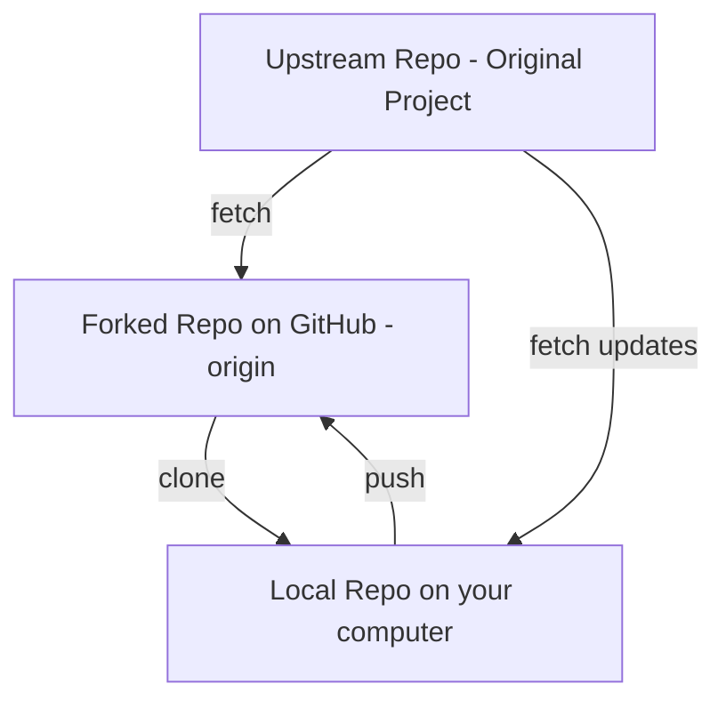
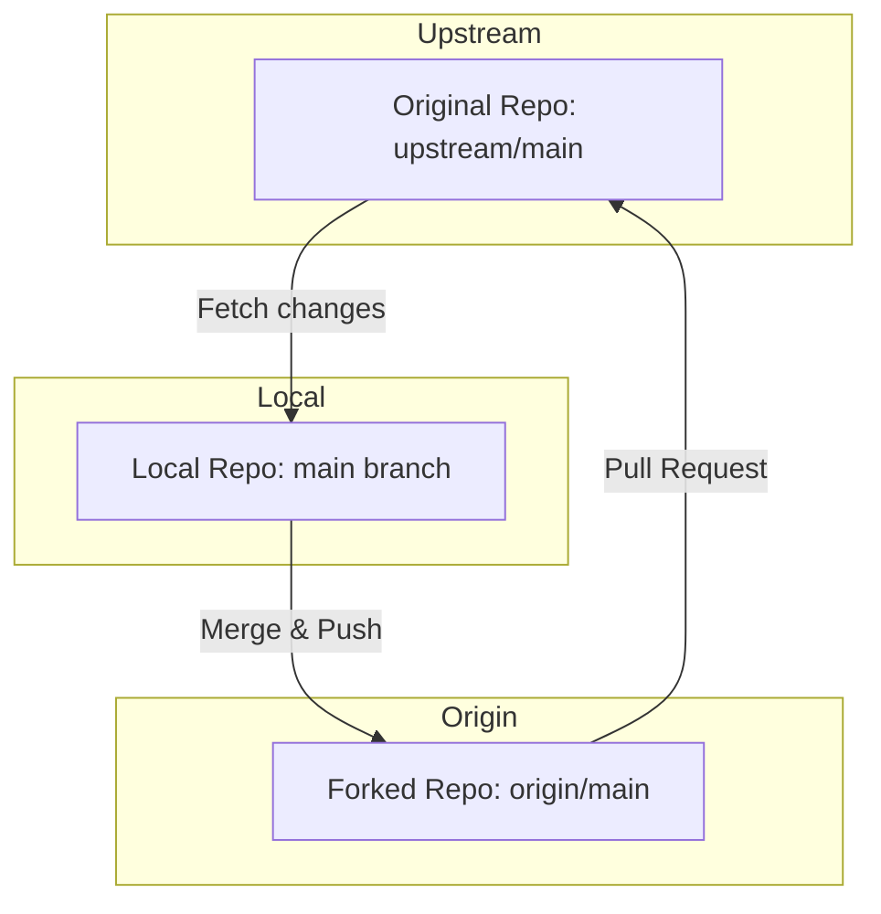
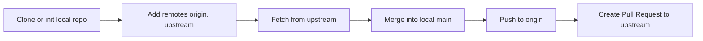

## Tracking Remote Branches & Understanding Upstream in Git

> A complete, step-by-step explanation of how **Git remotes**, **origin**, **upstream**, and **tracking branches** work together — with commands, workflow, and diagrams — in a logical order.

---

### 1. The Big Picture — How Git Remotes Work

When you clone or initialize a Git repository, you have:
- A **local repository** on your computer.
- One or more **remote repositories** (on GitHub, GitLab, etc.).

By default, the first remote is named **`origin`**.  
This usually represents **your own** repository (like your GitHub fork or main repo).

You can add more remotes — for example, **`upstream`** — which usually refers to **the original project** you forked from.

---

### 2. Basic Terminology

| Term | Meaning | Example |
|------|----------|----------|
| **Local repository** | Your working copy on your computer | `/myproject/.git` |
| **Remote repository** | Hosted version on GitHub or GitLab | `https://github.com/user/repo.git` |
| **Origin** | Default remote (your fork or main repo) | You push your commits here |
| **Upstream** | The original repo your fork came from | You fetch updates from here |
| **Tracking branch** | A local branch linked to a remote branch | `main` tracking `origin/main` |

---

### 3. Step-by-step: How Git connects everything

### Step 1: Check existing remotes
When you clone or initialize a repo, run:

```bash
git remote -v
```

You might see:

```
origin  https://github.com/your-username/myrepo.git (fetch)
origin  https://github.com/your-username/myrepo.git (push)
```

This means your local repo is connected to your **own remote** (origin).

---

### Step 2: Add the upstream remote

If you forked a repository, your fork’s remote is called **`origin`** by default.  
But you should also add the **original repository** as `upstream` to stay updated with it.

```bash
git remote add upstream https://github.com/original-owner/original-repo.git
```

Now check again:

```bash
git remote -v
```

Output:
```
origin    https://github.com/your-username/myrepo.git (fetch)
origin    https://github.com/your-username/myrepo.git (push)
upstream  https://github.com/original-owner/original-repo.git (fetch)
upstream  https://github.com/original-owner/original-repo.git (push)
```

---

### 4. Why Add an Upstream?

Adding an `upstream` remote allows you to:
- **Fetch new commits** from the original project.
- **Merge** those changes into your fork’s `main` branch.
- Keep your fork **in sync** with the source project.

This is essential when contributing to open-source projects.

---

### 5. Full Workflow — Keeping Your Fork in Sync

You can visualize the workflow like this:



---

### Step 1: Fetch latest changes from the upstream repo
```bash
git fetch upstream
```
This downloads all new commits and branches from the **upstream** remote, but does not merge them yet.

---

### Step 2: Switch to your local main branch
```bash
git checkout main
```
Make sure you’re on the main branch that tracks `origin/main`.

---

### Step 3: Merge upstream’s main into your local main
```bash
git merge upstream/main
```
This integrates new changes from the original repo into your local branch.

---

### Step 4: Push the updated main branch to your fork
```bash
git push origin main
```
This uploads your synced local branch to your **fork** (origin).

---

### 6. Tracking Remote Branches (Detailed)

A **tracking branch** is a local branch that has a relationship with a remote branch.

When you clone a repository:
- `main` → tracks → `origin/main`

To view tracking information:
```bash
git branch -vv
```

Output:
```
* main 123abcd [origin/main] Update docs
```
This means your local `main` branch is tracking the remote `origin/main`.

---

### To set or change a tracking branch:
If you created a new branch and want it to track a remote branch:

```bash
git push -u origin feature-branch
```

The `-u` (or `--set-upstream`) option establishes the tracking relationship.

Later, you can just use:
```bash
git push
git pull
```
without specifying the remote or branch name.

---

### 7. Checking & Managing Remotes

- List all remotes:
  ```bash
  git remote -v
  ```
- Show detailed info about one remote:
  ```bash
  git remote show origin
  git remote show upstream
  ```
- Rename a remote:
  ```bash
  git remote rename origin myfork
  ```
- Remove a remote:
  ```bash
  git remote remove upstream
  ```

---

### 8. Real-world Example — Open Source Contribution Workflow

Let’s connect everything in a realistic scenario.

###  Scenario
You fork `https://github.com/original-owner/project.git` → your fork is `https://github.com/you/project.git`

Then you:

1. Clone your fork locally:
   ```bash
   git clone https://github.com/you/project.git
   cd project
   ```

2. Add the original repo as upstream:
   ```bash
   git remote add upstream https://github.com/original-owner/project.git
   ```

3. Create a feature branch:
   ```bash
   git checkout -b feature-dark-mode
   ```

4. Make commits and push to your fork:
   ```bash
   git add .
   git commit -m "Added dark mode support"
   git push origin feature-dark-mode
   ```

5. Create a **Pull Request** from your fork (`origin`) to the upstream project’s main repo.

6. Later, when the upstream main branch gets new commits:
   ```bash
   git fetch upstream
   git checkout main
   git merge upstream/main
   git push origin main
   ```

This keeps your fork synced with the original repository.

---

### 9. Visual Summary



---

### 10. Key Takeaways

| Concept | Meaning | Typical Usage |
|----------|----------|----------------|
| `origin` | Your fork or own remote | Where you push your code |
| `upstream` | The original project | Where you fetch updates |
| `tracking branch` | Local ↔ remote relationship | Simplifies pull/push commands |
| `git fetch upstream` | Download latest commits from upstream | Keeps you updated |
| `git merge upstream/main` | Merge upstream’s main into yours | Sync with source |
| `git push origin main` | Push your updated branch to your fork | Publish updates |

---

### Summary Workflow Mind Map



---

### In short

- `origin` = your fork or your repo.  
- `upstream` = original repo you forked from.  
- `fetch` = get updates.  
- `merge` = apply updates locally.  
- `push` = upload to your fork.  
- `tracking branches` make syncing simpler.  
