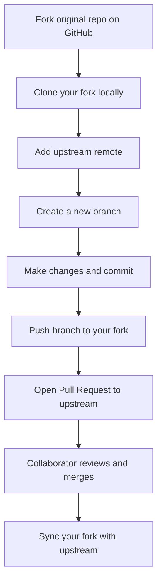

## Forking & Contributing to Open Source — Step-by-Step Guide

> A **complete workflow** that guides you through the entire process  — from **forking** to **creating pull requests**, **syncing your fork**, and **contributing like a pro** to open-source projects.  
> Includes commands, diagrams, and explanations for a full mental model.

---

### 1. Overview — The Open Source Contribution Flow

When contributing to an open-source project on GitHub, the typical workflow is:

1. **Fork** the repository (create your copy on GitHub).  
2. **Clone** your fork to your local machine.  
3. **Add the upstream remote** (link to the original project).  
4. **Create a new branch** for your feature or fix.  
5. **Make changes** and **commit** locally.  
6. **Push your branch** to your fork (origin).  
7. **Open a Pull Request (PR)** to the original repo (upstream).  
8. **Sync your fork** regularly with the upstream repo.

---

### 2. Forking — The Starting Point

**Forking** creates a copy of someone else's repository in your GitHub account.  
You can make changes freely without affecting the original project.

### Steps:
1. Go to the repository you want to contribute to on GitHub.
2. Click the **“Fork”** button (top-right).
3. Choose your account to fork it into.

You now have:

- Original repo → `https://github.com/original-owner/project.git`
- Your fork → `https://github.com/your-username/project.git`

---

### 3. Clone Your Fork Locally

Clone your forked repository to your local computer:

```bash
git clone https://github.com/your-username/project.git
cd project
```

Now, you have a local copy of your fork (remote = `origin`).

---

### 4. Add the Upstream Remote

The **upstream** remote points to the original project (the source of truth).

```bash
git remote add upstream https://github.com/original-owner/project.git
```

### Verify remotes:

```bash
git remote -v
```

Output example:
```
origin    https://github.com/your-username/project.git (fetch)
origin    https://github.com/your-username/project.git (push)
upstream  https://github.com/original-owner/project.git (fetch)
upstream  https://github.com/original-owner/project.git (push)
```

This setup allows you to **push** to your fork (`origin`) and **fetch** updates from the original repo (`upstream`).

---

### 5. Create a New Branch for Your Work

Never make changes directly on the `main` branch.  
Instead, create a **feature branch** to isolate your work.

```bash
git checkout -b feature/new-feature
```

> Naming tip: use clear names like `fix-typo`, `update-readme`, or `add-login-ui`.

---

### 6. Make Changes & Commit

Make your edits to files (code, docs, etc.), then stage and commit them.

```bash
git add .
git commit -m "Added new feature to improve performance"
```

You can make multiple commits if needed.

---

### 7. Push Your Branch to Your Fork

Push your local branch to your forked repo on GitHub (`origin`).

```bash
git push origin feature/new-feature
```

This uploads your branch so you can create a Pull Request.

---

### 8. Keep Your Fork Updated (Sync with Upstream)

Over time, the original project (`upstream`) may receive new changes.  
You’ll want to **sync** those updates into your fork.

### Step-by-step:

1. **Fetch** the latest updates from upstream:
   ```bash
   git fetch upstream
   ```

2. **Switch** to your local main branch:
   ```bash
   git checkout main
   ```

3. **Merge** upstream’s main branch into your local main:
   ```bash
   git merge upstream/main
   ```

4. **Push** the updated main to your fork:
   ```bash
   git push origin main
   ```

Now your fork’s main branch is up to date with the original project.

---

### 9. Create a Pull Request (PR)

A **Pull Request (PR)** is a proposal to merge your changes into the original repository.

### On GitHub:
1. Go to your **forked repository** on GitHub.
2. Click the **“Pull Requests”** tab.
3. Click **“New Pull Request.”**
4. Choose:
   - **Base repository:** the original project (e.g., `original-owner/project`)
   - **Base branch:** usually `main`
   - **Head repository:** your fork (`your-username/project`)
   - **Compare branch:** the branch you created (`feature/new-feature`)
5. Review your changes.
6. Write a **clear title and description** for your PR.
7. Click **“Create Pull Request.”**

---

### 10. Review Process

Once your PR is submitted:

- **Collaborators** or **maintainers** review your code.
- They might:
  - Request changes (feedback).
  - Merge your PR.
  - Or close it (if not accepted).

You can continue updating your branch — commits pushed to your PR branch will automatically update the PR.

---

### 11. Syncing Your Fork Regularly

Even after contributing, always keep your fork synced to avoid merge conflicts later.

### To sync your fork again:
```bash
git fetch upstream
git checkout main
git merge upstream/main
git push origin main
```

---

### 12. Complete Workflow Visualization



---

### 13. Real-World Example

Let’s say you want to contribute to `https://github.com/torvalds/linux`:

1. Fork the repo to your GitHub account.
2. Clone your fork:
   ```bash
   git clone https://github.com/your-username/linux.git
   cd linux
   ```
3. Add upstream:
   ```bash
   git remote add upstream https://github.com/torvalds/linux.git
   ```
4. Create a branch:
   ```bash
   git checkout -b fix-kernel-docs
   ```
5. Make edits, then:
   ```bash
   git add .
   git commit -m "Fixed typo in kernel documentation"
   ```
6. Push and open a PR:
   ```bash
   git push origin fix-kernel-docs
   ```
7. On GitHub → Create PR from `your-username:fix-kernel-docs` → to `torvalds:main`
8. After review → Maintainer merges → You sync your fork:
   ```bash
   git fetch upstream
   git checkout main
   git merge upstream/main
   git push origin main
   ```

---

### 14. Key Takeaways

| Step | Action | Command | Purpose |
|------|---------|----------|----------|
| 1 | Fork | (GitHub UI) | Create your copy |
| 2 | Clone | `git clone` | Bring fork to your machine |
| 3 | Add upstream | `git remote add upstream ...` | Link to original project |
| 4 | Create branch | `git checkout -b feature-x` | Work safely in isolation |
| 5 | Commit | `git add . && git commit -m "..."` | Save local changes |
| 6 | Push | `git push origin feature-x` | Upload to GitHub |
| 7 | Create PR | (GitHub UI) | Propose your changes |
| 8 | Sync fork | `git fetch upstream && git merge` | Stay up to date |

---

### 15. Mind Map — The Logical Flow

```mermaid
graph LR
    START[Fork Repo]
    CLONE[Clone Locally]
    ADDUP[Add Upstream Remote]
    NEWBR[Create Feature Branch]
    WORK[Make Changes & Commit]
    PUSH[Push Branch to Fork]
    PR[Create Pull Request]
    REVIEW[Collaborator Reviews & Merges]
    SYNC[Sync Fork with Upstream]

    START --> CLONE
    CLONE --> ADDUP
    ADDUP --> NEWBR
    NEWBR --> WORK
    WORK --> PUSH
    PUSH --> PR
    PR --> REVIEW
    REVIEW --> SYNC
```



---

### Summary

- **Fork** → your copy of the repo  
- **Clone** → bring it to your computer  
- **Add upstream** → connect to the original  
- **Branch** → isolate your changes  
- **Commit & Push** → save and upload  
- **Pull Request** → propose your changes  
- **Sync** → keep your fork updated  
