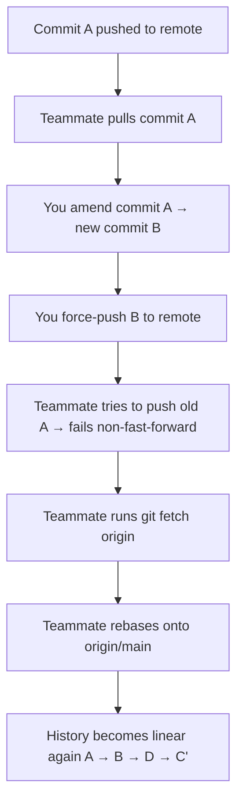

## Understanding `git commit --amend`

> Learn what `git commit --amend` really does, when to use it, what happens under the hood, and how to handle collaboration issues that arise when using it — especially after pushing commits.

---

### 1. What Is `git commit --amend`?

The command:

```bash
git commit --amend
```

is used to **modify the most recent commit**.  
It allows you to:

- Change the **commit message**.  
- Add or remove **files** from the last commit.  
- Fix small mistakes without creating a new commit.

---

### 2. How It Works Internally

When you run `git commit --amend`, Git doesn’t actually edit the old commit.  
Instead, it **creates a brand-new commit** (with a new hash) that *replaces* the previous one.

That means:
- The original commit is **discarded** (invisible in normal history).
- The amended commit looks the same but has a **different ID**.

This matters because **commit hashes define history** in Git — once changed, it’s technically a *new* history.

---

### 3. Use Cases

- You forgot to add a file before committing:
  ```bash
  git add forgotten-file.txt
  git commit --amend
  ```

- You made a typo in the commit message:
  ```bash
  git commit --amend -m "Fix typo in function name"
  ```

- You want to adjust something in the last commit instead of adding a new one.

---

### 4. The Danger of Amending Pushed Commits

If you amend a commit **after you’ve already pushed it**, things get tricky.

Why?  
Because amending changes the commit hash — which means your local history **no longer matches** the remote repository’s history.

You’ll need to **force-push** to update the remote:

```bash
git push --force
```

This force-push **overwrites history** on the remote, replacing the old commit with the new amended one.

---

### 5. The Real-World Scenario — Team Conflict

Let’s walk through what happens step-by-step.

### Step 1: You push a commit
- You push a commit (`A`) to the remote.
- Your teammate pulls it locally — now both have commit `A`.

### Step 2: You amend the commit
You run:
```bash
git commit --amend
git push --force
```

Git creates a **new commit `B`**, replacing `A` on the remote.

### Step 3: Your teammate tries to push
Your teammate’s branch still has commit `A`.  
When they try to push:

```
! [rejected] main -> main (non-fast-forward)
error: failed to push some refs to 'origin'
hint: Updates were rejected because the remote contains work that you do not have locally.
```

That’s because their local history no longer matches the remote — remote has `B`, local has `A`.

---

### 6. Why `git pull` Won’t Fix This Cleanly

Let’s understand what `git pull` actually does:

```bash
git pull
```

is shorthand for:
```bash
git fetch origin
git merge origin/main
```

So it:
1. Fetches the latest commits from the remote.  
2. Tries to merge them into your local branch.

---

### Example of the Problem

**Remote (after force-push):**  
`A → B → D`  
**Local:**  
`A → B → C`

Now you run `git pull`.  
Git tries to merge two diverged histories — one ending in `C`, another ending in `D`.  
It creates a **merge commit (M)** like this:

```
A → B → C
     ↘
       M
     ↗
       D
```

This results in a messy, non-linear history — undoing the clean sequence your teammate maintained with the force push.

---

### 7. The Correct Fix — Rebase Instead of Merge

When history is rewritten (via `amend` + `force push`),  
you should **rebase** your local commits on top of the updated remote.

```bash
git fetch origin
git rebase origin/main
```

This means:

> "Take my local commits and replay them on top of the latest commits from the remote."

This keeps the history clean and linear.

---

### 8. Fixing the Teammate’s Local Repository

Depending on whether they have local work, they can fix it in two ways:

---

### **Option 1: Rebase (if local changes exist)**

If your teammate has local commits they want to keep:

```bash
git fetch origin
git rebase origin/main
```

This will align their branch with the updated remote and replay their local commits on top of the new base.

---

### **Option 2: Reset (if no local changes)**

If they just want to match the remote and discard local commits:

```bash
git fetch origin
git reset --hard origin/main
```

**Warning:** `--hard` will delete all uncommitted local changes.

---

### 9. Understanding Each Command

### `git fetch origin`
Fetches updates from the remote repository but does **not** merge them:
> “Download new commits from the remote, but don’t modify my local branches yet.”

### `git rebase origin/main`
Replays your local commits on top of the latest `origin/main`:
> “Take my changes and apply them after the latest version from remote.”

### `git reset --hard origin/main`
Forcefully aligns your branch with the remote:
> “Forget my local commits and match the remote exactly.”

---

### 10. Visualizing the Amend & Rebase Workflow

### Before Amend
All copies are in sync:
```
Local:  A → B → C
Remote: A → B → C
```

### After Amend
You amended `C` → `D`, then force-pushed:
```
Local:  A → B → D
Remote: A → B → D
Teammate: A → B → C
```

### Teammate Fixes Their Branch

Option 1 — Using Rebase:
```bash
git fetch origin
git rebase origin/main
git push --force
```

Result:
```
Local:  A → B → D → C'
Remote: A → B → D → C'
```

Option 2 — Using Reset (if no local changes):
```bash
git fetch origin
git reset --hard origin/main
```

Result:
```
Local:  A → B → D
Remote: A → B → D
```

---

### 11. In Short — The Right Way to Recover After an Amend + Force Push

| Situation | Command | Explanation |
|------------|----------|-------------|
| You amended a commit before pushing | `git commit --amend && git push` | Safe — no rewrite issues |
| You amended after pushing | `git commit --amend && git push --force` | Rewrites history — teammates must rebase |
| Teammate needs to fix local branch | `git fetch origin && git rebase origin/main` | Clean way to align with rewritten history |
| Teammate has no local changes | `git reset --hard origin/main` | Quick reset to match remote |

---

### 12. Visual Flow of the Amend Scenario



---

### 13. TL;DR Summary

| ❌ Wrong Approach | ✅ Correct Approach |
|-------------------|--------------------|
| `git pull` after force-push | `git fetch && git rebase` |
| Merging diverged branches | Rebasing keeps history clean |
| Ignoring amend effects | Understand commit rewriting |
| Hard reset without knowing | Only use if no local changes |

---

### Final Key Takeaways

- `git commit --amend` **replaces** the last commit — it doesn’t edit it.  
- Once a commit is **pushed**, amending changes its **hash**, rewriting history.  
- If you amend after pushing, use **`git push --force`** (carefully).  
- Collaborators must **rebase or reset** to align with the new history.  
- Use `fetch + rebase` to stay clean and conflict-free.
