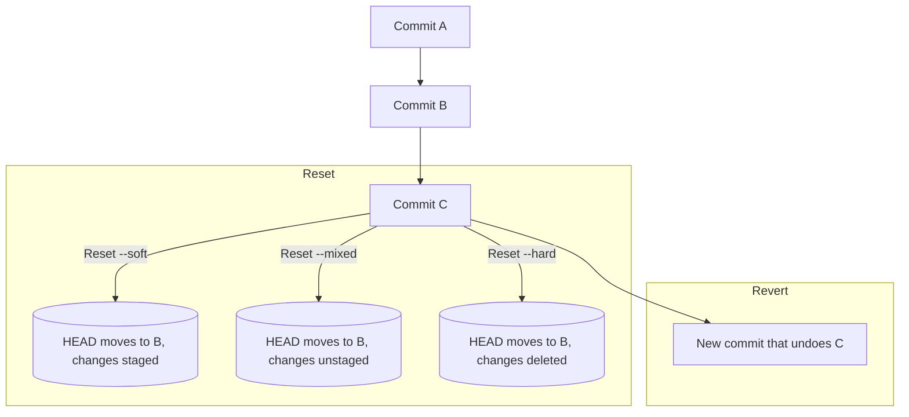

## Git Reset (soft, mixed, hard) vs Revert

> Learn how to safely undo changes in Git, the difference between **reset** and **revert**, and when to use each depending on whether your commit has been pushed or not.

---

### 1. Overview — Undoing in Git

Git provides multiple ways to **undo commits** or **rewind history**, depending on your goal:

| Command | Description | Safe to use after push? |
|----------|-------------|--------------------------|
| `git reset` | Moves branch pointer (changes history) | ❌ No |
| `git revert` | Creates a new commit that undoes another | ✅ Yes |
| `git rebase -i` | Lets you edit/delete/reword commits interactively | ⚠️ Only before pushing |

---

### 2. `git reset` — Move HEAD to a Previous Commit

`git reset` tells Git:
> “Move my branch pointer (HEAD) to a different commit.”

You can use three types of reset depending on how much you want to discard or keep.

---

### (a) `--soft` — Keep changes staged

```bash
git reset --soft HEAD~1
```

- Moves HEAD one commit back.
- Keeps **changes in the staging area** (ready to recommit).
- Useful when you want to **redo the last commit message** or **combine commits**.

✅ **Use case:**  
You committed too early — want to add a file or fix the message:
```bash
git add newfile.txt
git commit --amend
```

---

### (b) `--mixed` — Keep changes unstaged (default)

```bash
git reset --mixed HEAD~1
```

- Moves HEAD one commit back.
- Keeps **changes in working directory** (unstaged).
- Unstages files but doesn’t delete them.

✅ **Use case:**  
You want to undo the last commit but keep all changes in your working tree.

---

### (c) `--hard` — Discard everything

```bash
git reset --hard HEAD~1
```

- Moves HEAD one commit back.
- **Deletes changes permanently** (both from staging and working directory).
- ⚠️ Once done, those changes are gone unless recoverable via `reflog`.

✅ **Use case:**  
You made a mistake and want to completely remove the commit and its changes.

---

### 3. Removing a Commit That Hasn’t Been Pushed Yet

If your commit is **local only** (not yet pushed to GitHub):

### Option 1 — Delete the commit and discard its changes
```bash
git reset --hard HEAD~1
```

### Option 2 — Remove commit but keep staged changes
```bash
git reset --soft HEAD~1
```

### Option 3 — Remove a specific older commit
You can use **interactive rebase**:
```bash
git rebase -i HEAD~n
```

In the editor:
- Find the commit you want to delete.
- Change `pick` → `drop`.
- Save and close.

---

### 4. Removing a Commit That **Has Been Pushed** (GitHub Repo)

Once you’ve pushed, the commit exists in the remote history.  
Undoing it now requires extra care because others may have pulled it.

---

### (a) Using `git reset` (destructive)

You can rewind your branch and **force push** to GitHub.

```bash
git reset --hard HEAD~1
git push origin main --force
```

This **rewrites history** — the old commit disappears from the remote.

**Caution:**  
If teammates have already pulled that commit, they’ll get errors or divergent histories.  
Only use this if you’re sure it won’t disrupt others.

---

### (b) Using `git revert` (safer)

`git revert` is the **safe, non-destructive** way to undo commits already pushed.

It doesn’t delete or rewrite history.  
Instead, it creates a **new commit** that undoes the changes from a previous commit.

```bash
git revert <commit-hash>
git push origin <branch-name>
```

**Use case:**  
You pushed a commit but realized it broke something — revert it safely without rewriting history.

---

### Example:

Let’s say history looks like this:

```
A → B → C
```

You realize commit `C` introduced a bug.  
Run:

```bash
git revert C
```

Now your history becomes:

```
A → B → C → C'
```

`C'` is a **new commit** that undoes the effects of `C`.

---

### 5. When to Use Reset vs Revert

| Scenario | Recommended Command | Reason |
|-----------|---------------------|--------|
| Undo last commit (not pushed yet) | `git reset --soft HEAD~1` | Easy to edit/recommit |
| Delete last commit completely | `git reset --hard HEAD~1` | Clean reset |
| Remove an old commit locally | `git rebase -i HEAD~n` | Interactive control |
| Undo commit already pushed (safe) | `git revert <hash>` | Keeps shared history safe |
| Undo commit already pushed (force) | `git reset --hard <commit> && git push --force` | Only if you understand the risks |

---

### 6. Visualizing the Concepts

### **Before Reset**
```
A → B → C (HEAD)
```

### **After `git reset --soft HEAD~1`**
```
A → B (HEAD)
```
Changes from `C` are **staged**.

### **After `git reset --mixed HEAD~1`**
```
A → B (HEAD)
```
Changes from `C` are **unstaged**.

### **After `git reset --hard HEAD~1`**
```
A → B (HEAD)
```
Changes from `C` are **lost**.

---

### **After `git revert C`**
```
A → B → C → C'
```
`C'` undoes everything from `C` but keeps history intact.

---

### 7. Real-World Example

Imagine you committed and pushed something like a password by mistake.

### ❌ Dangerous way:
```bash
git reset --hard HEAD~1
git push origin main --force
```
→ Rewrites history (dangerous if others pulled already).

### ✅ Safe way:
```bash
git revert HEAD
git push origin main
```
→ Adds a new commit that removes the sensitive data, safely preserving the timeline.

---

## ⚙️ 8. Summary Table

| Action | Command | Keeps History? | Safe After Push? | Keeps Changes? |
|---------|----------|----------------|------------------|----------------|
| Undo last commit (keep staged) | `git reset --soft HEAD~1` | ❌ No | ❌ No | ✅ Yes |
| Undo last commit (keep files) | `git reset --mixed HEAD~1` | ❌ No | ❌ No | ✅ Yes |
| Undo last commit (delete all) | `git reset --hard HEAD~1` | ❌ No | ❌ No | ❌ No |
| Undo pushed commit (safe) | `git revert <hash>` | ✅ Yes | ✅ Yes | ✅ Yes |
| Delete pushed commit (force) | `git reset --hard <hash>` + `git push --force` | ❌ No | ⚠️ Risky | ❌ No |

---

### 9. Mermaid Diagram — Reset vs Revert Flow



---

### 10. TL;DR Summary

| Command | Use it when... |
|----------|----------------|
| `git reset --soft HEAD~1` | You want to edit or recommit with same changes |
| `git reset --hard HEAD~1` | You want to completely remove recent commit |
| `git revert <hash>` | You want to undo safely after pushing |
| `git rebase -i` | You want to remove or edit older commits interactively |
