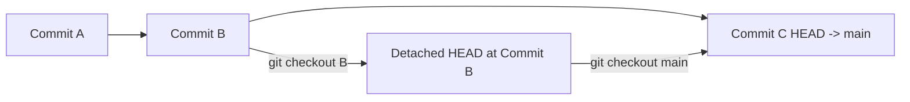

## Git Checkout to Previous Commits

> Learn how to **view**, **checkout**, and **restore** previous commits in Git safely — both temporarily and permanently.

---

### 1. What Does “Checkout a Previous Commit” Mean?

When you **checkout** a previous commit, you are telling Git:

> “Move my working directory and HEAD pointer to the state of this old commit.”

This lets you **inspect or test older versions** of your project **without losing any history**.

---

### 2. Checking Commit History

To see your commit history:

```bash
git log --oneline
```

Example output:
```
a1b2c3d (HEAD -> main) Add README
d4e5f6g Fix bug in login
h7i8j9k Initial commit
```

Each line shows:
- The **commit hash** (`a1b2c3d`)
- The **commit message**
- The branch HEAD is currently on (`main`)

---

### 3. Checkout a Previous Commit (Detached HEAD State)

To move temporarily to an earlier commit:

```bash
git checkout <commit-hash>
```

Example:
```bash
git checkout d4e5f6g
```

**What happens:**
- You enter a **detached HEAD** state.
- Your files now reflect the state of the project at that commit.
- You can explore, test, or even build the code.

**But note:**  
You are *not* on any branch anymore — commits made here won’t be part of your main branch unless you create a new branch.

---

### 4. Understanding Detached HEAD

When you checkout a specific commit, HEAD no longer points to a branch tip (like `main`), but directly to that commit.

```
Normal:
HEAD → main → a1b2c3d

Detached:
HEAD → d4e5f6g   (no branch)
```

To see your status:
```bash
git status
```
It will show:
```
HEAD detached at d4e5f6g
```

---

### 5. If You Want to Make Changes Based on That Commit

You can **create a new branch** from that old commit before making changes.

```bash
git checkout -b new-feature-branch <commit-hash>
```

Example:
```bash
git checkout -b hotfix d4e5f6g
```

Now you can safely make commits on this new branch — no more detached HEAD!

---

### 6. Returning Back to the Latest Commit (Main Branch)

Once you’re done exploring:

```bash
git checkout main
```

Your working directory goes back to the latest commit on `main`.

If you were on a different branch:
```bash
git checkout <branch-name>
```

---

### 7. Visual Representation



---

### 8. Compare Two Commits

To see what changed between two commits:

```bash
git diff <old-commit> <new-commit>
```

Example:
```bash
git diff h7i8j9k d4e5f6g
```

---

### 9. Restore Files from a Previous Commit (Without Checking Out Entirely)

If you only want to restore a file from an older commit into your current branch:

```bash
git checkout <commit-hash> -- <file-path>
```

Example:
```bash
git checkout d4e5f6g -- src/app.js
```

This pulls `app.js` from that old commit into your current working directory.

---

### 10. TL;DR Summary

| Action | Command | Description |
|--------|----------|-------------|
| View commit history | `git log --oneline` | See list of commits |
| Checkout previous commit | `git checkout <hash>` | Move temporarily to that commit |
| Create branch from old commit | `git checkout -b <branch> <hash>` | Start new work based on older commit |
| Go back to main branch | `git checkout main` | Return to latest commit |
| Restore file from old commit | `git checkout <hash> -- <file>` | Bring back a file from history |

---

### Example Workflow

```bash
# View history
git log --oneline

# Checkout an old commit temporarily
git checkout 123abcd

# Explore or test old version

# Create a new branch from it
git checkout -b debug-old-bug 123abcd

# Make changes & commit
git add .
git commit -m "Fix old bug from version 1.2"

# Push it
git push origin debug-old-bug

# Return to main branch
git checkout main
```
