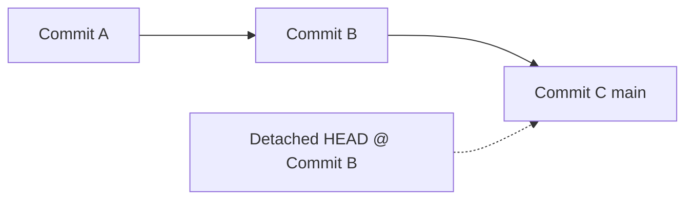

## Detached HEAD State in Git

> One of the most confusing terms for beginners in Git — let’s break it down simply, visually, and practically.

---

### 1. What is HEAD in Git?

Before understanding **Detached HEAD**, you need to know what `HEAD` is.

In Git, **HEAD** is a pointer that tells you:

> “Where am I right now?”

- Usually, `HEAD` points to the **latest commit** of your **current branch**.
- Example: if you’re on `main`, `HEAD` points to the latest commit on `main`.

```
HEAD → main → [Commit C]
```

---

### 2. What Happens Normally

When you make a new commit, it’s added **on top of the branch HEAD points to**.

```
A → B → C (HEAD -> main)
```

You’re on the `main` branch, and `HEAD` points to it.  
When you commit again, you’ll get:

```
A → B → C → D (HEAD -> main)
```

---

### 3. What is a Detached HEAD?

You get a **Detached HEAD** when you checkout a specific **commit**, **tag**, or **older state** directly, **not through a branch**.

Example:

```bash
git checkout a1b2c3d
```

Now `HEAD` no longer points to a branch.  
It directly points to that specific commit.

```
HEAD → a1b2c3d (no branch)
```

Git says:
```
Note: checking out 'a1b2c3d'.
You are in 'detached HEAD' state.
```

---

### 4. Why It’s Called “Detached”

Normally, `HEAD` is *attached* to a branch — meaning your commits move that branch forward.

When `HEAD` is *detached*, it points **directly** to a commit, not to a branch label.

### Visual:


So if you make new commits while detached:
- They’re **not linked** to any branch.
- They’ll be **lost** once you checkout another branch (unless you save them).

---

### 5. What Happens If You Commit in Detached HEAD State

Example:

```bash
git checkout a1b2c3d
# Now in detached state
git commit -m "Testing old version"
```

Git creates a new commit, but it’s **floating** — not on any branch.

```
A → B → (HEAD → C*)
```

If you checkout back to `main`, you’ll lose that commit from view (it’s not deleted, but orphaned).

---

### 6. How to Save Work Done in Detached HEAD

If you made some commits in a detached state and want to keep them:

```bash
git branch new-branch-name
```

Example:
```bash
git branch hotfix-old-version
git checkout hotfix-old-version
```

Now your work is safely saved on `hotfix-old-version`.

---

### 7. How to Exit Detached HEAD

To return to your branch (like `main`):

```bash
git checkout main
```

Git will bring you back to the tip of that branch:
```
HEAD → main → [latest commit]
```

---

### 8. Summary Table

| Situation | HEAD Points To | State | What Happens if You Commit? |
|------------|----------------|--------|-----------------------------|
| On a branch (`main`) | Branch tip | Attached | Commits move branch forward |
| On a specific commit | Commit directly | Detached | Commits not linked to a branch |
| On a tag | Tag (specific commit) | Detached | Same — commits “float” |
| After creating branch from detached HEAD | New branch | Attached | Safe — commits now tracked |

---

### 9. Common Use Cases for Detached HEAD

| Use Case | Command | Purpose |
|-----------|----------|----------|
| Testing old versions | `git checkout <commit-hash>` | Explore past code |
| Building from a tag | `git checkout tags/v1.0.0` | Compile older release |
| Creating patch/fix from old commit | `git checkout <old-hash>` → `git checkout -b fix-old` | Branch off safely |
| Temporarily inspecting code | `git checkout <hash>` | Look, don’t touch |

---

### 10. Warnings

-  Don’t stay detached for long if you plan to commit.
-  Always create a branch before committing if you want to preserve changes:
  ```bash
  git checkout -b new-branch
  ```
-  Detached commits not saved in a branch may be **garbage collected** later.

---

### 11. Real-World Example

```bash
# See commits
git log --oneline
# a1b2c3d Update docs
# e4f5g6h Add new API
# i7j8k9l Initial commit

# Checkout older commit
git checkout e4f5g6h

# Now detached
# Make a small fix
git commit -am "Temporary fix test"

# Save it permanently
git branch fix-v1.0
git checkout fix-v1.0

# Return to main
git checkout main
```

Now:
```
main:   a1b2c3d
fix-v1.0: e4f5g6h → fix commit
```

---

### 12. Quick Recap

| Command | Description |
|----------|--------------|
| `git checkout <hash>` | Go to a previous commit (detached HEAD) |
| `git branch <name>` | Create a branch from that state |
| `git checkout <branch>` | Return to normal state |
| `git status` | Check if you’re detached |
| `git reflog` | Recover lost detached commits |

---

### TL;DR

- **HEAD** → pointer to your current commit.
- **Detached HEAD** → you’re not on a branch.
- **Committing in detached HEAD** → commits “float” without a branch.
- **Fix:** create a branch to save them.

---

**Best Practice**
> When exploring or testing old commits:  
> Always create a new branch before making changes.  
> Keeps your work traceable and safe.


