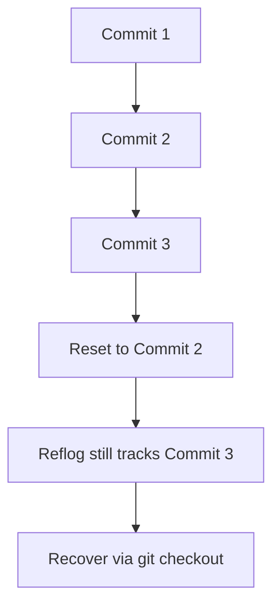

## Understanding `git reflog`

> Ever deleted a branch, lost commits after a reset, or messed up a rebase?  
> `git reflog` is your **time machine** — it lets you recover lost commits and restore your repo to a previous working state.

---

### 1. What is `git reflog`?

In Git, the **reflog** (reference log) is a record of all the changes that happened to the **HEAD pointer** — including branch checkouts, commits, rebases, merges, resets, and more.

Think of it as:
> “A local history of *what HEAD was pointing to*, even if those commits are no longer in your visible branches.”

### Example:
Every time you move `HEAD` (like by committing, checking out, or resetting), Git stores an entry in `.git/logs/HEAD`.

---

### 2. Why is `git reflog` Important?

It helps you **recover lost work** when:
- You accidentally deleted a branch.  
- You did a `git reset --hard`.  
- You force-pushed and lost commits.  
- A rebase went wrong.  
- You entered a detached HEAD and lost commits.

Without `reflog`, these would seem “gone forever.”  
With `reflog`, you can **go back in time** to find and restore any commit.

---

### 3. How to View the Reflog

Run:

```bash
git reflog
```

### Example Output:
```
a1b2c3d (HEAD -> main) HEAD@{0}: commit: Fixed broken tests
e4f5g6h HEAD@{1}: commit: Added new API
i7j8k9l HEAD@{2}: checkout: moving from feature-branch to main
m9n0o1p HEAD@{3}: commit (amend): Updated README
```

Each line shows:
- **Commit hash**
- **HEAD position**
- **Action performed**
- **Message**

---

### 4. Understanding the Format

```
HEAD@{n}
```

- `{0}` → current state of HEAD  
- `{1}` → previous state  
- `{2}` → before that, and so on.

Every move of HEAD gets logged here.

---

### 5. Using `git reflog` to Recover Lost Commits

### Example Scenario

You accidentally ran:
```bash
git reset --hard HEAD~1
```
Now your latest commit is gone from `git log`.

But don’t panic — it’s still in the reflog.

###  Step 1: Check the reflog
```bash
git reflog
```
You’ll see something like:
```
a1b2c3d HEAD@{0}: reset: moving to HEAD~1
e4f5g6h HEAD@{1}: commit: Added payment gateway
```

###  Step 2: Restore to the old commit
```bash
git checkout e4f5g6h
```

or reset back:
```bash
git reset --hard e4f5g6h
```

Now your lost commit is back!

---

### 6. Recovering Deleted Branches

### Suppose you deleted a branch accidentally:
```bash
git branch -D feature-login
```

You can still find where it pointed.

### Step 1: Check reflog
```bash
git reflog
```

Find the commit where you last worked on that branch.

```
c3d4e5f HEAD@{5}: checkout: moving from feature-login to main
```

### Step 2: Restore it
```bash
git checkout -b feature-login c3d4e5f
```

Your branch is back — fully restored.

---

### 7. Reflog vs Log — Key Difference

| Command | Purpose | Shows Lost Commits? | Scope |
|----------|----------|---------------------|--------|
| `git log` | Shows commit history of current branch | ❌ No | Visible branch commits |
| `git reflog` | Shows history of HEAD movements | ✅ Yes | Local repo only |

> 💡 `git log` is the visible timeline.  
> `git reflog` is the hidden **“black box recorder”** of Git.

---

### 8. Restore After Force Push or Rebase

If you force-pushed or rebased and lost commits:

```bash
git reflog
```

Find the old commit:
```
HEAD@{4}: commit: Added authentication middleware
```

Then recover it:
```bash
git checkout -b recover-auth a1b2c3d
```

You now have all your lost changes in a new branch.

---

### 9. Cleaning Reflog

Git automatically prunes reflog entries older than 90 days.  
To manually clean it:

```bash
git reflog expire --expire=30.days refs/heads/main
git gc --prune=now
```

This helps free space if you’ve done a lot of history rewrites.

---

### 10. Real-World Scenario — Step-by-Step

### Situation:
You committed some code and then reset by mistake.

```bash
git commit -m "Add login feature"
git reset --hard HEAD~1
```

Now your code and commit are gone.

### Recovery:
```bash
# 1. See the reflog
git reflog
# Find the commit hash before reset, say 'd4e5f6g'

# 2. Checkout to that commit
git checkout d4e5f6g

# 3. Restore your branch
git branch feature-login-recover
```

Done — your lost work is back.

---

### 11. Common Reflog Commands

| Command | Description |
|----------|--------------|
| `git reflog` | View HEAD movement history |
| `git reflog show <branch>` | View reflog for a specific branch |
| `git checkout HEAD@{n}` | Move to a specific previous state |
| `git reset --hard HEAD@{n}` | Permanently restore to that state |
| `git branch <name> <hash>` | Create branch from old commit |
| `git reflog expire` | Manually prune reflog entries |

---

### 12. TL;DR Summary

| Situation | Command | What It Does |
|------------|----------|---------------|
| Lost commit after reset | `git reflog` → find → `git reset --hard <hash>` | Restore commit |
| Deleted branch | `git reflog` → find → `git checkout -b <branch> <hash>` | Recover branch |
| Rebase/force push messed up history | `git reflog` → find clean commit | Recover correct version |
| Want to move HEAD back | `git checkout HEAD@{n}` | Jump to older state |

---

### 13. Visualization



---

### 14. Best Practices

Check `git reflog` before panicking.  
Create a new branch from lost commits to preserve history.  
Avoid relying on reflog as a permanent backup — it’s **local** and **expires**.
