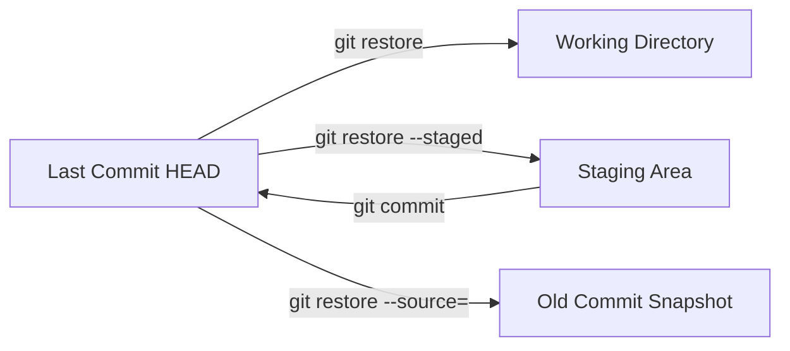

## Understanding `git restore` and `git checkout --` — Undoing Changes Safely  

> Git lets you undo changes at multiple levels — working directory, staging area, or even committed history.  
> `git restore` (introduced in Git 2.23) provides a **clearer, safer** way to do what older `git checkout --` used to do.

---

### 1. Why `git restore` Exists

Before Git 2.23, the `git checkout` command had **too many responsibilities**:
- Switching branches  
- Checking out commits  
- Discarding local changes  

This caused confusion and accidental data loss.  
So, Git introduced two specialized commands:

| New Command | Purpose |
|--------------|----------|
| `git switch` | For changing or creating branches |
| `git restore` | For undoing or restoring file changes |

**Modern Git best practice:**
> Use `git switch` for branches and `git restore` for files.

---

### 2. What `git restore` Does

`git restore` restores files from a specific state:
- From the **index (staging area)** — to undo `git add`
- From the **last commit (HEAD)** — to discard working directory changes

### Syntax:
```bash
git restore [options] [<path>...]
```

Common options:
- `--staged`: Unstage files (move them from index back to working directory)
- `--source=<commit>`: Restore files from a specific commit
- No flags: Restore working directory files from `HEAD`

---

### 3. Restoring Changes in Different Areas

### A. Discard Unstaged Changes (Working Directory → Last Commit)

You edited a file but haven’t staged it yet:
```bash
git restore file.txt
```
or the older equivalent:
```bash
git checkout -- file.txt
```

➡ Restores `file.txt` to how it was in the last commit (`HEAD`).

---

### B. Unstage a File (Staging Area → Working Directory)

You ran `git add file.txt` by mistake.  
Undo that without changing file contents:
```bash
git restore --staged file.txt
```

Equivalent old way:
```bash
git reset HEAD file.txt
```

➡ File remains modified, but no longer staged for commit.

---

### C. Restore from a Specific Commit

You can restore a file to how it looked in an older commit:
```bash
git restore --source=<commit-hash> file.txt
```

Example:
```bash
git restore --source=abc123 file.txt
```

➡ Replaces `file.txt` in your working directory with the version from commit `abc123`.

---

### D. Restore All Files to Last Commit

To discard **all** local changes in your working directory:
```bash
git restore .
```

> This permanently deletes unstaged changes.

---

### 4. Examples — Step by Step

### Example 1: Undo Local Edits Before Staging
```bash
# You edited app.js but haven't staged it yet
git restore app.js
```
Reverts app.js to how it was in the last commit.

---

### Example 2: Undo a `git add`
```bash
git add main.py
git restore --staged main.py
```
Unstages `main.py` but keeps your edits.

---

### Example 3: Restore from Another Branch or Commit
```bash
git restore --source=feature-branch README.md
```
Restores README.md from another branch without switching branches.

---

### Example 4: Discard Everything and Start Fresh
```bash
git restore --staged .
git restore .
```
Completely resets working directory and staging area to match last commit.

---

### 5. Comparison — `git restore` vs `git checkout --`

| Command | Area Affected | Description |
|----------|----------------|--------------|
| `git checkout -- <file>` | Working directory | Discards unstaged changes (old style) |
| `git restore <file>` | Working directory | Discards unstaged changes (new preferred style) |
| `git restore --staged <file>` | Staging area | Unstages a file |
| `git restore --source=<commit>` | Working directory | Restores file from specific commit |
| `git reset HEAD <file>` | Staging area | Legacy way to unstage files |

**Recommended:** Always use `git restore` — it’s safer and explicit.

---

### 6. Real-World Scenario: Mistaken Edits

### Scenario:
You accidentally modified two files and added one by mistake.

```bash
# Situation:
# modified: index.html
# modified: app.js
# staged: style.css

# Fix it:
git restore index.html app.js          # Discard unwanted changes
git restore --staged style.css         # Unstage the file
```

Now your working directory is clean and staging area is empty.

---

### 7. Restore vs Reset vs Revert

| Command | Scope | Destroys Commits? | Use Case |
|----------|--------|------------------|-----------|
| `git restore` | Working/staging area | ❌ No | Undo uncommitted changes |
| `git reset` | Moves HEAD / branch pointer | ✅ Can | Undo commits locally |
| `git revert` | Creates new commit | ❌ No | Undo committed changes safely (public history) |

---

### 8. Visualization



---

### 9. TL;DR Summary

| Action | Command |
|---------|----------|
| Undo unstaged changes in working directory | `git restore <file>` |
| Undo staged changes (unstage file) | `git restore --staged <file>` |
| Restore a file from an old commit | `git restore --source=<hash> <file>` |
| Restore everything | `git restore --staged . && git restore .` |
| Old way to discard changes | `git checkout -- <file>` |

---

## 10. Best Practices

Prefer `git restore` over `git checkout --` for clarity.  
Use `--staged` carefully — it only affects the index, not file content.  
Avoid `git restore .` unless you’re sure — it permanently deletes unstaged work.  
For committed changes, use `git revert` instead.

---

