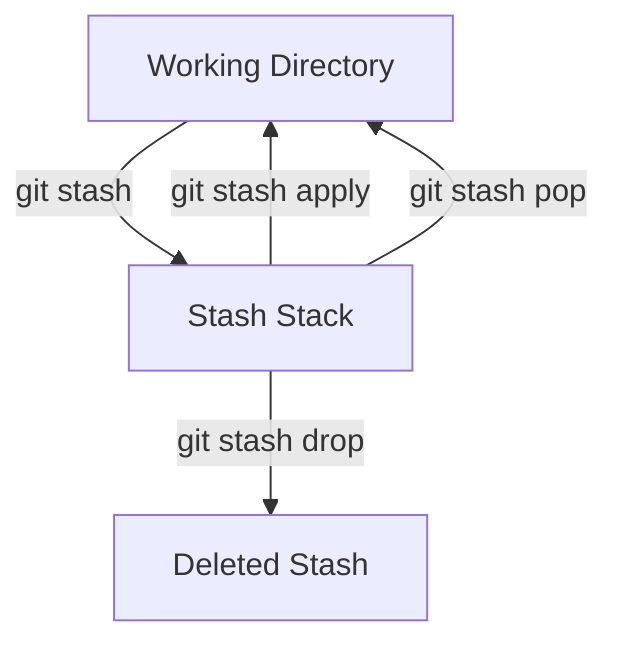
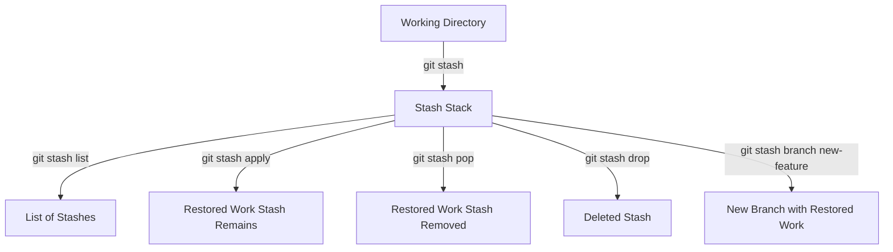

## Git Stash — Save Your Work Without Committing  

> Sometimes you’re in the middle of work but need to switch branches or tasks —  
> yet your current changes aren’t ready to commit.  
> That’s where **`git stash`** comes in — it lets you **temporarily store (stash)** your changes,  
> leaving your working directory clean.

---

### 1. What Is Git Stash?

**`git stash`** temporarily saves (or *stashes*) your **uncommitted changes** — both staged and unstaged — so you can safely switch branches or pull updates without committing.

Once stashed, your working directory is clean — as if you never made those changes — but you can bring them back anytime with `git stash apply` or `git stash pop`.

---

### 2. Basic Concept (How It Works)

When you run `git stash`, Git:
1. Saves your **modified tracked files** and **staged changes** in a hidden stash stack.
2. Reverts your working directory to match `HEAD` (the last commit).
3. Keeps the stash in `.git/refs/stash`.

Think of it like a temporary clipboard for unfinished work.



---

### 3. Common Git Stash Commands

| Command | Description |
|----------|--------------|
| `git stash` | Save current changes (both staged & unstaged) |
| `git stash save "message"` | Save stash with a custom message |
| `git stash list` | List all saved stashes |
| `git stash show` | Show changes in the latest stash |
| `git stash show -p stash@{n}` | Show detailed diff for a specific stash |
| `git stash apply stash@{n}` | Apply stash without removing it from the list |
| `git stash pop stash@{n}` | Apply stash **and** remove it from the list |
| `git stash drop stash@{n}` | Delete a specific stash entry |
| `git stash clear` | Delete all stashes |
| `git stash branch <branch-name>` | Create a new branch from a stash and apply it automatically |

---

### 4. Creating Stashes

### A. Basic Stash (Unnamed)
```bash
git stash
```
✅ Saves all tracked file changes (staged & unstaged).  
❌ Does not stash **untracked** or **ignored** files by default.

---

### B. Named Stash
```bash
git stash save "My WIP changes on login feature"
```

Adds a human-readable message.  
Still appears in the list as `stash@{n}`, but with your custom description.

Example output:
```
stash@{0}: On main: My WIP changes on login feature
stash@{1}: On main: Fix navbar responsiveness
```

---

### C. Stash Including Untracked Files
By default, untracked files (new files not added with `git add`) are ignored.

To stash them too:
```bash
git stash -u
# or
git stash --include-untracked
```

To stash *both* untracked and ignored files:
```bash
git stash -a
# or
git stash --all
```

---

### 5. Viewing and Managing Stashes

### List All Stashes
```bash
git stash list
```

Example:
```
stash@{0}: On main: Add login feature
stash@{1}: On main: WIP - refactor dashboard
stash@{2}: On main: Fix bug in auth middleware
```

---

### Show What’s Inside a Stash
```bash
git stash show
```
Shows summary of the latest stash.

Add `-p` (patch) for full diff:
```bash
git stash show -p stash@{1}
```

---

### 6. Applying or Restoring Stashes

### Apply (Keep in List)
```bash
git stash apply stash@{1}
```
Re-applies the stash’s changes.  
Stash **remains** in the list.

If no index is given, applies the latest (`stash@{0}`).

---

### Pop (Apply & Remove)
```bash
git stash pop stash@{1}
```
Re-applies the stash  
Removes it from the stash list afterward.

---

### Drop (Delete Without Applying)
```bash
git stash drop stash@{1}
```
Deletes a specific stash entry.

To remove all stashes:
```bash
git stash clear
```

---

### 7. Managing Multiple Stashes

Each stash is like an entry in a stack (LIFO — *last in, first out*).

Example workflow:
```bash
git stash save "first stash"
git stash save "second stash"
git stash save "third stash"
git stash list
```

Output:
```
stash@{0}: third stash
stash@{1}: second stash
stash@{2}: first stash
```

👉 `stash@{0}` is always the most recent.

To restore the second stash:
```bash
git stash apply stash@{1}
```

---

### 8. Create a Branch from a Stash

You can create a new branch to continue your stashed work safely:
```bash
git stash branch new-feature stash@{1}
```
- Creates a branch named `new-feature`
- Applies the specified stash
- Drops it from stash list automatically

---

### 9. Understanding What Gets Stashed

| File Type | Stashed by Default? | Notes |
|------------|----------------------|--------|
| Tracked modified files | ✅ Yes | Always stashed |
| Staged files | ✅ Yes | Included automatically |
| Untracked files | ❌ No | Use `-u` or `--include-untracked` |
| Ignored files | ❌ No | Use `-a` or `--all` |

---

### 10. Common Pitfalls and Conflicts

- **Conflicts may occur** when applying a stash if:
  - The same files were modified both in the stash and your working directory.
  - You’ve rebased or merged since creating the stash.

Git will notify you of merge conflicts — resolve them manually and continue.

---

### 11. Real-World Scenario

### Scenario:
You’re working on a feature but need to quickly switch to another branch to fix a bug.

```bash
# Step 1: Save your current work
git stash save "WIP: user profile layout"

# Step 2: Switch branch
git switch bugfix/login-error

# Step 3: Fix and commit the bug
git commit -am "Fix login error on mobile"

# Step 4: Return and restore your work
git switch main
git stash apply stash@{0}
# or simply
git stash pop
```

You safely switched branches without losing or committing unfinished work.

---

### 12. Visualizing the Workflow



---

### 13. TL;DR Summary

| Action | Command | Effect |
|---------|----------|--------|
| Save current changes | `git stash` | Saves changes, cleans working directory |
| Save with message | `git stash save "msg"` | Adds a message to stash |
| Include untracked files | `git stash -u` | Includes new untracked files |
| List all stashes | `git stash list` | Shows saved stashes |
| Show stash diff | `git stash show -p stash@{n}` | Displays changes in stash |
| Apply stash | `git stash apply stash@{n}` | Restores changes, keeps stash |
| Pop stash | `git stash pop stash@{n}` | Restores changes, removes stash |
| Drop stash | `git stash drop stash@{n}` | Deletes specific stash |
| Clear all stashes | `git stash clear` | Removes all stashes |
| Create branch from stash | `git stash branch <branch>` | Applies stash on a new branch |

---

### 14. Best Practices

Always add a message: `git stash save "WIP: feature-name"`  
Use `git stash list` frequently to track your stashes.  
Use `git stash pop` only when you’re sure it applies cleanly.  
If unsure — use `git stash apply` first (stash remains safe).  
Remember: stashes are **local only** — they’re not pushed to remotes.

