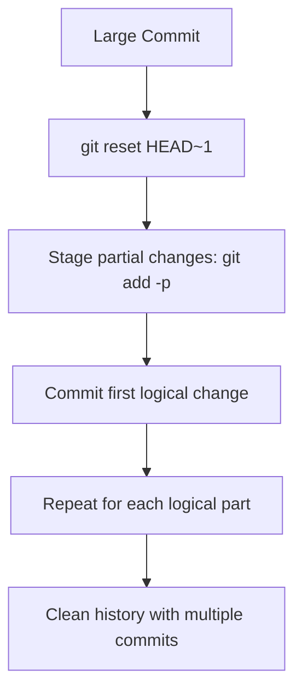

## Splitting Commits in Git — Breaking One Commit into Smaller Logical Commits

> Sometimes a single commit contains too many unrelated changes.  
> To make your Git history cleaner and more meaningful, you can **split one large commit into multiple smaller commits**.  

---

### 1. What Does "Splitting a Commit" Mean?

**Splitting a commit** means taking one commit that has multiple changes  
and dividing it into several smaller commits, each focused on a single logical task.

### Example:
You accidentally committed too much in one go:
```
commit: Added login feature, fixed navbar bug, and updated footer
```

You want to split this into:
```
commit 1: Added login feature
commit 2: Fixed navbar bug
commit 3: Updated footer
```

---

### 2. Why Split Commits?

Improves code readability and version control  
Makes code reviews easier  
Simplifies debugging (using `git bisect`)  
Keeps commit history clean and modular  
Aligns with best Git practices — **“One commit per logical change”**

---

### 3. Methods to Split a Commit

There are two main ways:

1. **Split the most recent commit**
2. **Split an older commit** (using interactive rebase)

---

### 4. Method 1: Split the Most Recent Commit

### Step 1: Uncommit but Keep Changes
Undo the last commit but keep all changes in the staging area (index):
```bash
git reset HEAD~1
```
Now your files are unstaged, but the changes remain in your working directory.

---

### Step 2: Stage and Commit in Parts
You can now selectively stage and commit specific files or lines.

#### Stage file-by-file:
```bash
git add login.js
git commit -m "Added login feature"

git add navbar.css
git commit -m "Fixed navbar bug"

git add footer.html
git commit -m "Updated footer"
```

#### Or stage line-by-line interactively:
```bash
git add -p
```
This allows you to review each hunk and decide whether to stage it (`y`, `n`, `s`, etc.).

---

### Step 3: Verify the History
```bash
git log --oneline
```

You’ll see:
```
d4e5f6g Updated footer
c3d4e5f Fixed navbar bug
b2c3d4e Added login feature
```

You successfully split your last commit into 3 smaller commits.

---

### 5. Method 2: Split an Older Commit (Interactive Rebase)

If the commit you want to split is **not the latest one**, you’ll need to use **interactive rebase**.

### Step 1: Start Interactive Rebase
Find how far back the commit is:
```bash
git log --oneline
```

Example:
```
a1b2c3e Added login
b2c3d4f Fixed bug
c3d4e5f Updated footer
```

If you want to split the second commit (“Fixed bug”), you’ll rebase up to 3 commits back:
```bash
git rebase -i HEAD~3
```

---

### Step 2: In the Rebase Editor
You’ll see:
```
pick a1b2c3e Added login
pick b2c3d4f Fixed bug
pick c3d4e5f Updated footer
```

Change the one you want to split (`Fixed bug`) from `pick` to `edit`:

```
pick a1b2c3e Added login
edit b2c3d4f Fixed bug
pick c3d4e5f Updated footer
```

Save and close the editor.

---

### Step 3: Git Pauses at That Commit

Git stops and shows:
```
Stopped at b2c3d4f... Fixed bug
You can amend the commit now.
```

Reset the commit but keep changes unstaged:
```bash
git reset HEAD^
```

Now your working directory has all the files from that commit.

---

### Step 4: Split Into Smaller Commits

Stage and commit parts individually, same as before:

```bash
git add file1.js
git commit -m "Fixed navbar bug"

git add file2.css
git commit -m "Refactored CSS for layout"
```

---

### Step 5: Continue the Rebase
Once done:
```bash
git rebase --continue
```

Git will replay the rest of the commits.

---

### Step 6: Verify
```bash
git log --oneline
```

Now you’ll see your previously single commit split into multiple commits — clean and clear.

---

### 6. Important Notes

- If you already **pushed** the commits to a remote repository:
  - You’ll need to **force push** the rewritten history:
    ```bash
    git push origin branch-name --force-with-lease
    ```
- If others are working on the same branch, coordinate before force-pushing.
- Avoid rewriting history of shared branches (like `main`).

---

### 7. Quick Commands Summary

| Task | Command |
|------|----------|
| Undo last commit, keep changes | `git reset HEAD~1` |
| Stage and commit specific files | `git add <file>` → `git commit -m "msg"` |
| Start interactive rebase | `git rebase -i HEAD~n` |
| Mark commit to split | Change `pick` → `edit` |
| Uncommit during rebase | `git reset HEAD^` |
| Continue rebase | `git rebase --continue` |
| Safe force push after rebase | `git push --force-with-lease` |

---

### 8. Real-World Example

You accidentally committed multiple features at once:

```
commit: Added profile page, fixed navbar bug, updated CSS
```

To split:

```bash
git reset HEAD~1
git add profile.js
git commit -m "Added profile page"

git add navbar.css
git commit -m "Fixed navbar bug"

git add style.css
git commit -m "Updated CSS"
```

Done — now you have three separate, meaningful commits.

---

### 9. Visual Flow Diagram


