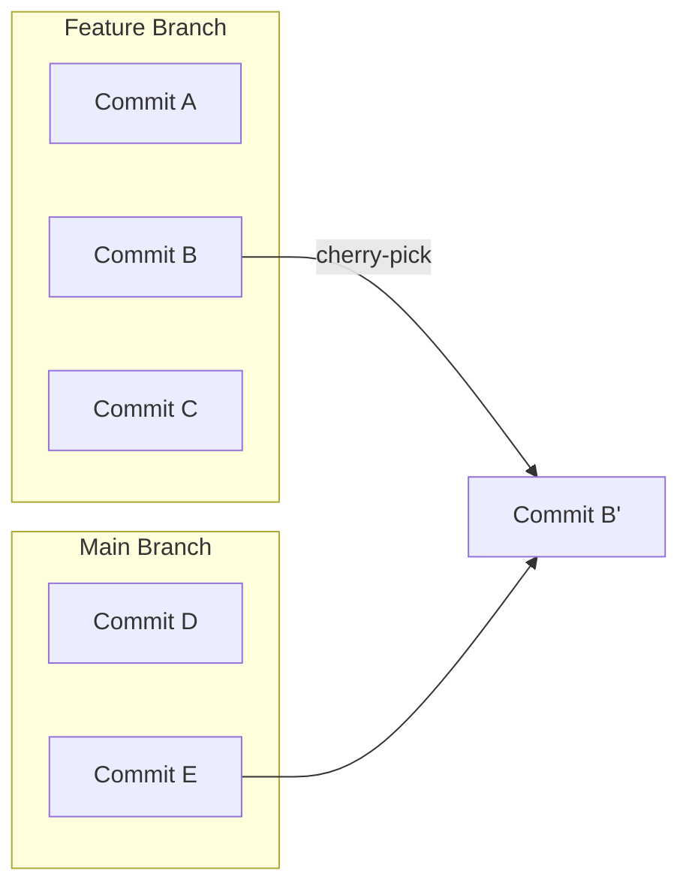

## Git Cherry-Pick — Applying Specific Commits from One Branch to Another

> **`git cherry-pick`** lets you **selectively apply individual commits** from one branch to another — without merging or rebasing the entire branch.  
> It’s like saying, “I just want *that one commit* from another branch.”

---

### 1. What Is Cherry-Picking?

When you **cherry-pick a commit**, Git takes the changes introduced by that commit  
and applies them to your **current branch**, creating a **new commit** with the same content (but a new hash).

### Example
You have:
```
feature/login:
A — B — C
main:
A — D — E
```
You want to apply commit `C` (from `feature/login`) onto `main`.

You’d do:
```bash
git checkout main
git cherry-pick <commit-hash-of-C>
```

Now your `main` branch becomes:
```
A — D — E — C'
```
(`C'` is a new commit that duplicates the changes from `C`.)

---

### 2. When to Use Cherry-Pick

You fixed a bug on one branch and want to apply the same fix to another branch  
You accidentally committed to the wrong branch  
You need to apply a hotfix from `develop` to `main`  
You want to copy a few commits, not the entire branch history  

---

### 3. How to Cherry-Pick a Commit

### Step 1: Identify the Commit
Use:
```bash
git log --oneline
```
Example output:
```
a1b2c3d Fix login bug
b2c3d4e Update CSS
c3d4e5f Add API endpoint
```

### Step 2: Checkout the Target Branch
```bash
git checkout main
```

### Step 3: Cherry-Pick the Commit
```bash
git cherry-pick a1b2c3d
```

Git will apply the changes from that commit and create a new one on the current branch.

---

### 4. Cherry-Picking Multiple Commits

You can cherry-pick multiple commits **one by one** or **as a range**:

### Multiple commits (separate):
```bash
git cherry-pick a1b2c3d b2c3d4e c3d4e5f
```

### A continuous range:
```bash
git cherry-pick A^..C
```
This applies commits from A (exclusive) up to and including C.

---

### 5. Handling Conflicts During Cherry-Pick

If there are conflicts, Git will pause and show:
```
error: could not apply <commit-hash>
```

Resolve conflicts manually, then:
```bash
git add <resolved-files>
git cherry-pick --continue
```

To abort the cherry-pick process:
```bash
git cherry-pick --abort
```

---

### 6. Skipping a Commit (During Series)

If you’re cherry-picking multiple commits and one fails, but you want to skip it:
```bash
git cherry-pick --skip
```

---

### 7. Cherry-Pick from Another Branch Without Switching

You don’t need to checkout the branch — you can reference it directly:
```bash
git cherry-pick feature/login~2
```
This applies the commit two steps before HEAD on the `feature/login` branch.

---

### 8. Cherry-Picking with Commit Message Options

- **Keep original commit message (default):**
  ```bash
  git cherry-pick <hash>
  ```

- **Edit the commit message before applying:**
  ```bash
  git cherry-pick -e <hash>
  ```

- **Don’t commit automatically (just apply changes):**
  ```bash
  git cherry-pick -n <hash>
  ```
  > Use this if you want to review or combine multiple changes before committing.

---

### 9. Cherry-Picking Merge Commits

If you want to cherry-pick a merge commit:
```bash
git cherry-pick -m 1 <merge-commit-hash>
```
Here:
- `-m` specifies the “mainline parent”.
- Use `1` for the first parent (usually the branch you merged *into*).

Be cautious — cherry-picking merge commits can be complex.

---

### 10. Real-World Example

### Scenario:
You fixed a security bug in `develop` and want the same fix on `main`.

```bash
git log develop --oneline
# find commit: 9f8e7d6 Fixed security vulnerability
```

Now apply it to main:

```bash
git checkout main
git cherry-pick 9f8e7d6
git push origin main
```

The bug fix is now in both branches, without merging all other `develop` changes.

---

### 11. Important Notes

- Cherry-picking **creates new commits** with new hashes.
- Avoid cherry-picking commits that others might have already merged — can cause duplicates or conflicts.
- If you’ve cherry-picked commits between branches frequently, rebasing or merging might be a cleaner long-term approach.

---

### 12. Visual Summary



`Commit B` from `feature` is now also on `main` as `Commit B'` (a new commit with same changes).

---

### 13. Common Commands Reference

| Task | Command |
|------|----------|
| Cherry-pick one commit | `git cherry-pick <hash>` |
| Cherry-pick multiple commits | `git cherry-pick <hash1> <hash2>` |
| Cherry-pick range of commits | `git cherry-pick A^..C` |
| Abort cherry-pick | `git cherry-pick --abort` |
| Continue after conflict | `git cherry-pick --continue` |
| Skip problematic commit | `git cherry-pick --skip` |
| Apply changes without committing | `git cherry-pick -n <hash>` |
| Edit commit message | `git cherry-pick -e <hash>` |
