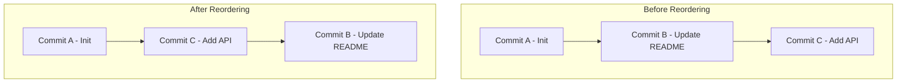

## Reordering Commits in Git (Interactive Rebase)

> Reordering commits in Git allows you to **change the sequence of your commit history** — for clarity, better organization, or to prepare for a clean pull request.

This is done using **interactive rebase (`git rebase -i`)**.

---

### 1. What Does Reordering Commits Mean?

Every time you make a commit, Git adds it **on top** of your previous commits in a linear chain.

Sometimes, you might realize:
- You made commits in the wrong order.
- A fix should logically come before a feature commit.
- You want to clean up history before merging.

👉 That’s where **interactive rebase** comes in.

---

### 2. The Command

```bash
git rebase -i HEAD~n
```

- `HEAD~n` → means you’re going back **n commits** from the current HEAD.  
- `-i` → means **interactive**, so Git opens an editor allowing you to **reorder**, **squash**, or **drop** commits.

---

### 3. Example Scenario

Let’s say your commit history looks like this:

```bash
git log --oneline
```

```
d6f8e9c Fix typo in login
c5b6a8d Add authentication API
b4a3c2d Update README
a1b2c3d Initialize project
```

But logically, the README update (`b4a3c2d`) should come **after** authentication API commit.

---

### 4. Reordering Commits Step-by-Step

### Step 1: Start Interactive Rebase

You want to reorder the last 3 commits:

```bash
git rebase -i HEAD~3
```

---

### Step 2: Git Opens Your Editor

You’ll see something like:

```
pick b4a3c2d Update README
pick c5b6a8d Add authentication API
pick d6f8e9c Fix typo in login
```

Each line represents a commit.  
They are listed **oldest → newest** (top → bottom).

---

### Step 3: Reorder the Lines

Simply move the lines in the order you want.

For example:
```
pick c5b6a8d Add authentication API
pick b4a3c2d Update README
pick d6f8e9c Fix typo in login
```

Save and close the editor (`:wq` in Vim).

---

### Step 4: Let Git Replay the Commits

Git will **replay the commits** in the order you specified.  
If no conflicts occur, you’ll see:
```
Successfully rebased and updated refs/heads/main.
```

If there are conflicts, Git will pause and show:
```
error: could not apply <commit-hash>
```

Resolve conflicts, then run:
```bash
git add <resolved-file>
git rebase --continue
```

Or, to cancel:
```bash
git rebase --abort
```

---

### 5. Important Notes

- Reordering commits **changes commit hashes**, because the commit history is rewritten.  
- If you already **pushed** those commits to a remote branch, you’ll need to force push:
  ```bash
  git push --force
  ```
- Avoid rebasing shared branches (where teammates are working) — it rewrites history!

---

### 6. Real-World Example

Imagine you made the following commits on a `feature/login` branch:

1. Add console.log debugging  
2. Build login form  
3. Fix typo in login form  

But you want to reorder commits so “Build login form” comes first.

You’d run:
```bash
git rebase -i HEAD~3
```

Then reorder them as:
```
pick <hash2> Build login form
pick <hash3> Fix typo in login form
pick <hash1> Add console.log debugging
```

Save → Git reapplies commits in the new order.  
Now your history looks clean and logical.

---

### 7. Reordering with Squash

Sometimes when reordering, you might also want to **combine commits** (e.g., small fixes into one).  
While in the rebase editor, you can change `pick` to `squash` (or `s`).

Example:
```
pick a1b2c3 Add feature X
squash d4e5f6 Fix small bug in feature X
```

This merges the second commit into the first.

---

### 8. Reordering Commits from a Specific Commit Hash

Instead of `HEAD~n`, you can start the rebase from a specific commit:
```bash
git rebase -i <commit-hash>^
```
> The caret (`^`) includes the parent of that commit, so you can reorder from that point onward.

---

### 9. If You Reordered Wrongly

If you mess up and want to undo the rebase:
```bash
git reflog
```
Find the commit before the rebase started, then:
```bash
git reset --hard <commit-hash>
```

---

### 10. Visual Representation



---

### 11. Common Commands Reference

| Action | Command |
|--------|----------|
| Start interactive rebase | `git rebase -i HEAD~n` |
| Continue after resolving conflict | `git rebase --continue` |
| Skip current commit | `git rebase --skip` |
| Abort rebase | `git rebase --abort` |
| View reflog to recover | `git reflog` |
| Hard reset to previous state | `git reset --hard <hash>` |
| Force push after reordering | `git push --force` |
