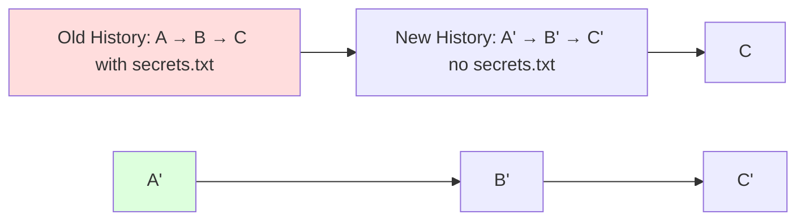

## Rewriting Git History Safely — Using `git filter-branch` and `git filter-repo`

> Sometimes you need to **rewrite Git history** — remove sensitive files, rename authors, clean up large binary files, or restructure your project.  
> This process can be done using tools like **`git filter-branch`** (old) or the newer, faster, and safer **`git filter-repo`**.

---

### 1. What Does “Rewriting History” Mean?

Rewriting history means **changing existing commits** in a repository — altering their metadata (author, date, message), or content (files, directories).

For example:
- Removing passwords, API keys, or large files from old commits.
- Correcting author emails or names.
- Moving files or folders in all past commits.
- Cleaning up project history before open-sourcing.

> **Rewriting history changes commit hashes.**  
> That means you’ll need to **force-push** to update the remote repository, and others will have to re-clone or reset their local copies.

---

### 2. Why You Might Need to Rewrite History

| Scenario | Goal |
|-----------|------|
| You accidentally committed `.env` with secrets | Remove the file completely from all history |
| You committed a large binary file (e.g., `.zip`) | Reduce repo size by removing it |
| You changed your email/username | Update author info in all past commits |
| You want to restructure folders | Move files or directories in every commit |

---

### 3. The Two Main Tools

### Option 1: `git filter-branch` (legacy)

Older built-in command (still available in Git) but **slow** and **error-prone** for large repos.

### Option 2: `git filter-repo` (modern, recommended)

New standalone Python-based tool by Git maintainers.  
Faster, safer, and much simpler.

To install:
```bash
# macOS (Homebrew)
brew install git-filter-repo

# Linux (using pip)
pip install git-filter-repo
```

---

### 4. Rewriting History with `git filter-repo` (Recommended Way)

### Example 1: Remove a file from entire history

```bash
git filter-repo --path secrets.txt --invert-paths
```

This completely deletes `secrets.txt` from all commits.

Afterward, verify:
```bash
git log --all -- secrets.txt
# (No results = successfully removed)
```

---

### Example 2: Remove a folder from history

```bash
git filter-repo --path build/ --invert-paths
```

Removes the entire `build/` directory from all commits.

---

### Example 3: Change author information globally

```bash
git filter-repo --mailmap my-mailmap.txt
```

The `my-mailmap.txt` file should look like:
```
Old Name <old@example.com> New Name <new@example.com>
```

This rewrites all commits using the updated author info.

---

### Example 4: Rename or move a folder across all commits

```bash
git filter-repo --path old-folder/ --to-subdirectory-filter new-folder
```

This effectively renames `old-folder` to `new-folder` in all commits.

---

### Example 5: Keep only a subdirectory (split repo)

```bash
git filter-repo --subdirectory-filter src
```

Keeps only the contents of `src/` folder — removes everything else from history.

Perfect for extracting a module or component into its own repo.

---

### 5. Rewriting History with `git filter-branch` (Legacy)

**Not recommended** for large repos — use only for learning or when `filter-repo` isn’t available.

Example: remove a file from entire history
```bash
git filter-branch --force --index-filter \
"git rm --cached --ignore-unmatch secrets.txt" \
--prune-empty --tag-name-filter cat -- --all
```

Clean up backup references:
```bash
rm -rf .git/refs/original/
git reflog expire --expire=now --all
git gc --prune=now --aggressive
```

---

### 6. Cleaning Up After Rewriting History

After removing or rewriting commits, always:

```bash
# Remove reflogs and backup refs
rm -rf .git/refs/original/
git reflog expire --expire=now --all
git gc --prune=now --aggressive
```

This ensures your repository doesn’t retain old blobs or objects.

---

### 7. Force Push Updated History

Once history is rewritten locally, you must update the remote:

```bash
git push origin --force --all
git push origin --force --tags
```

> This will **overwrite remote history**.  
> Anyone else using the repo must re-clone or hard-reset.

---

### 8. How Teammates Can Sync Safely After Rewrite

If you’ve rewritten shared history:

Each teammate should do:
```bash
git fetch origin
git reset --hard origin/main
```

Or, better yet:
```bash
rm -rf .git
git clone <repo-url>
```

---

### 9. Example Workflow — Removing Sensitive File

### Situation:
You accidentally committed a `.env` file with API keys and pushed it to GitHub.

### Fix:

1. Remove `.env` from all commits:
   ```bash
   git filter-repo --path .env --invert-paths
   ```

2. Verify it’s gone:
   ```bash
   git log --all -- .env
   ```

3. Force-push to update remote:
   ```bash
   git push origin --force --all
   ```

4. Add `.env` to `.gitignore`:
   ```bash
   echo ".env" >> .gitignore
   git add .gitignore
   git commit -m "Add .env to .gitignore"
   git push origin main
   ```

5. Invalidate the exposed API keys immediately.

---

### 10. Visualizing History Rewrite



---

### 11. Important Warnings

- Rewriting history **changes commit hashes**.
- Force-pushing rewritten history will **break clones** of others.
- Never rewrite public/shared branches unless absolutely necessary.
- Always back up your repo first:
  ```bash
  git clone --mirror <repo-url> backup-repo.git
  ```

---

### 12. Quick Reference Table

| Task | Command | Safe? |
|------|----------|-------|
| Remove file from all commits | `git filter-repo --path file --invert-paths` | ✅ |
| Remove folder | `git filter-repo --path folder/ --invert-paths` | ✅ |
| Change author info | `git filter-repo --mailmap file.txt` | ✅ |
| Keep only a folder | `git filter-repo --subdirectory-filter folder` | ✅ |
| Legacy remove file | `git filter-branch ...` | ⚠️ Slow, deprecated |
| Clean backups after filter-branch | `git gc --prune=now --aggressive` | ✅ |
